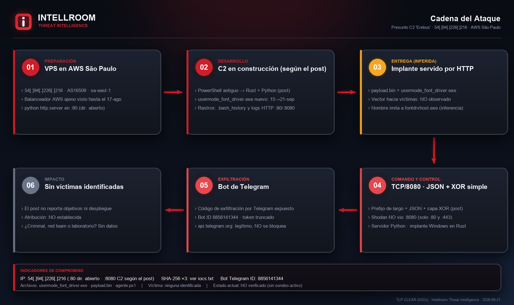
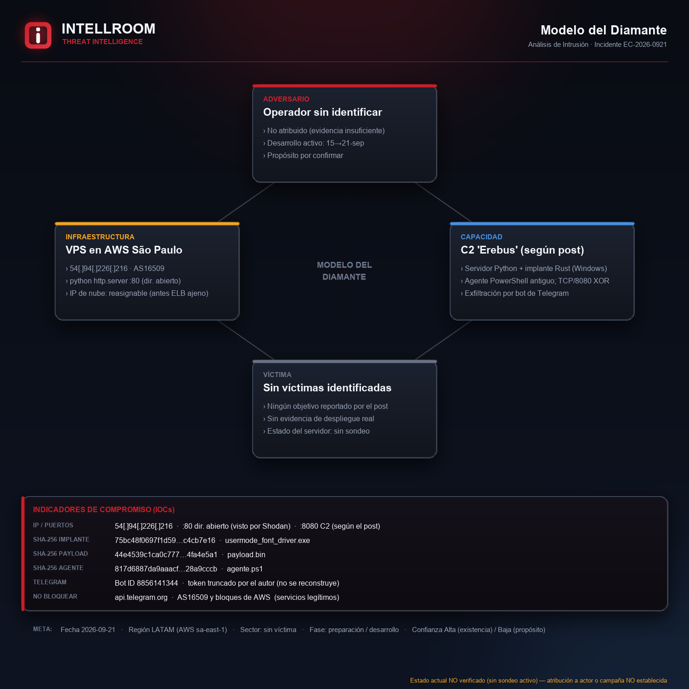

# Presunto C2 «Erebus» en un directorio abierto (AWS São Paulo)

**IP:** `54[.]94[.]226[.]216` (puerto 80: directorio abierto · 8080: canal de control según el post) · **Hosting:** AS16509 Amazon EC2, sa-east-1 · **TLP:CLEAR**
**Fecha del hallazgo:** 21-09-2026 · **Contrastado por Intellroom:** 21-09-2026 (solo fuentes pasivas)

Un investigador independiente ([@Yusufcancakiir](https://x.com/Yusufcancakiir), [post original](https://x.com/Yusufcancakiir/status/2102113345306316828)) publicó el hallazgo de un servidor expuesto que aloja lo que describe como un **C2 propio llamado «Erebus»**: servidor en Python, implante de Windows en Rust, un agente PowerShell más antiguo, payloads, `.bash_history`, rastros de desarrollo y código de exfiltración por Telegram. Señala que el agente antiguo y la versión nueva no usan el mismo protocolo (la nueva: TCP/8080, JSON con prefijo de largo y una capa XOR simple) y lo lee como etapas distintas del desarrollo. No lo asocia a ningún actor conocido.

Intellroom lo contrastó de forma **pasiva** con los banners de Shodan de la misma IP, sin tocar el servidor ni descargar nada, y confirmó lo esencial.

## Qué confirman los datos pasivos

- **El servidor existe y estaba expuesto:** `SimpleHTTP/0.6 Python/3.14.4` (`python -m http.server`) en el puerto 80 de una instancia EC2 de São Paulo, con título «Directory listing for /».
- **Tres artefactos del post están en el listado:** `usermode_font_driver.exe`, `payload.bin` y `.bash_history`, más `c2_modules/`, `transfer/`, `BACKUP/`, `.ssh/` y dos logs de servidores HTTP (puertos 80 y 8080).
- **Exposición observada de al menos 5 días y 19 horas:** primer banner del directorio abierto el 15-09-2026 (20:47 UTC), último el 21-09 (15:40 UTC).
- **Desarrollo en curso:** entre el 15 y el 21-09 aparecieron `usermode_font_driver.exe` y `BACKUP/`. Lo ve Shodan, de forma independiente al post.
- **La IP es de nube y puede reasignarse:** la última vez que Shodan la vio como balanceador de carga de otro cliente de AWS fue el 17-08, y no hay banners hasta el 15-09. **Todo bloqueo debe llevar fecha de revisión.**

**No se atribuye a ningún actor ni campaña.** No hay víctimas identificadas y el propósito (criminal, ejercicio ofensivo autorizado o laboratorio de desarrollo) no se puede determinar. El nombre «Erebus» es homónimo de un framework de comando y control en GitHub con otro stack (Go y C, protobuf sobre HTTPS o DNS): **no hay relación evidenciada**.

## Indicadores (resumen)

| Tipo | Valor | Acción |
|---|---|---|
| IP | `54[.]94[.]226[.]216` | Bloquear en salida y **revisar a los 30 días** |
| SHA-256 | `75bc48f0697f1d593c0533844917ef5a5c36d194fb7d9f78bc073dadc4cb7e16` (`usermode_font_driver.exe`) | Bloquear |
| SHA-256 | `44e4539c1ca0c7777637aa15878006b86d11b745714cc354b0a3dace4fa4e5a1` (`payload.bin`) | Bloquear |
| SHA-256 | `817d6887da9aaacf14a6523a875bd6cdf45f65b49c2aa7a40c6aa39528a9cccb` (`agente.ps1`) | Bloquear |
| ID de bot de Telegram | `8856141344` | Detectar |
| Servicios legítimos | `api.telegram.org`, AS16509 | **No bloquear** el ASN ni el bloque de AWS; `api.telegram.org` solo si la política de la organización lo decide |

Los hashes los publicó el investigador y **Intellroom no los verificó**: no se descargó ninguna muestra ni tienen reputación pública. Confianza baja, pero bloquearlos no tiene costo.

## Evidencia

| | |
|---|---|
|  |  |

## Documentos

- **[`Erebus_C2_OpenDir_21092026.txt`](Erebus_C2_OpenDir_21092026.txt)**: ficha completa con resumen, línea de tiempo, qué **no** es un IOC, el listado del directorio, evaluación de la fuente (Admiralty), MITRE ATT&CK verificado contra la matriz vigente, ideas de caza, acciones y todo lo que no se pudo verificar.
- **[`iocs.txt`](iocs.txt)**: solo indicadores, con acción por línea (`[BLOQUEAR]` / `[DETECTAR]` / `[VIGILAR]` / `[NO ES UN IOC]`), defanged.
- **[`evidencia_shodan_banner.json`](evidencia_shodan_banner.json)**, **[`listado_shodan_15092026.html`](listado_shodan_15092026.html)** y **[`listado_shodan_21092026.html`](listado_shodan_21092026.html)**: evidencia cruda de Shodan (consulta pasiva por API) que sostiene la ficha. Sumas de verificación en **[`evidencia.sha256`](evidencia.sha256)**.

## Lo que no se pudo verificar ni se publica

- **El contenido de los archivos y el estado actual del servidor:** no se descargó ni se abrió nada, y el servidor no fue contactado.
- **La reputación de las huellas:** AlienVault OTX no tiene pulsos para ninguna de las tres; abuse.ch y VirusTotal no se pudieron consultar desde este entorno.
- **El canal TCP/8080:** Shodan nunca lo vio abierto (solo 80 y 443 en 5 banners).
- **El token de Telegram:** el autor lo publicó truncado. Intellroom no lo reconstruye, no lo usa y **no reproduce ningún fragmento**; solo se publica el ID numérico del bot.

---
*Intellroom Threat Intelligence: análisis pasivo (Shodan, ARIN RDAP, AlienVault OTX, GreyNoise, ipinfo, búsqueda web abierta y la matriz de MITRE ATT&CK). Sin ningún contacto con el servidor.*
