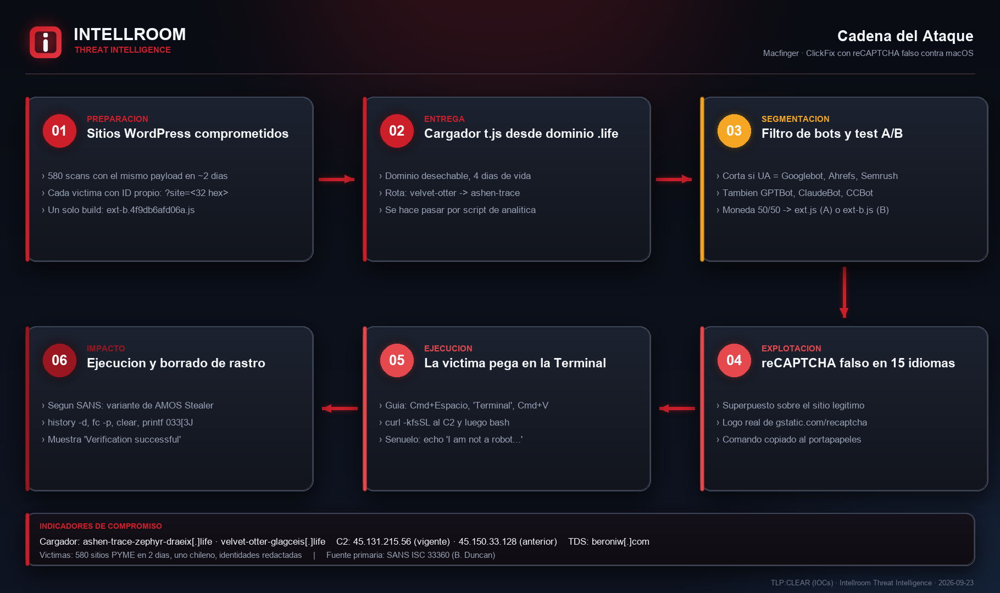
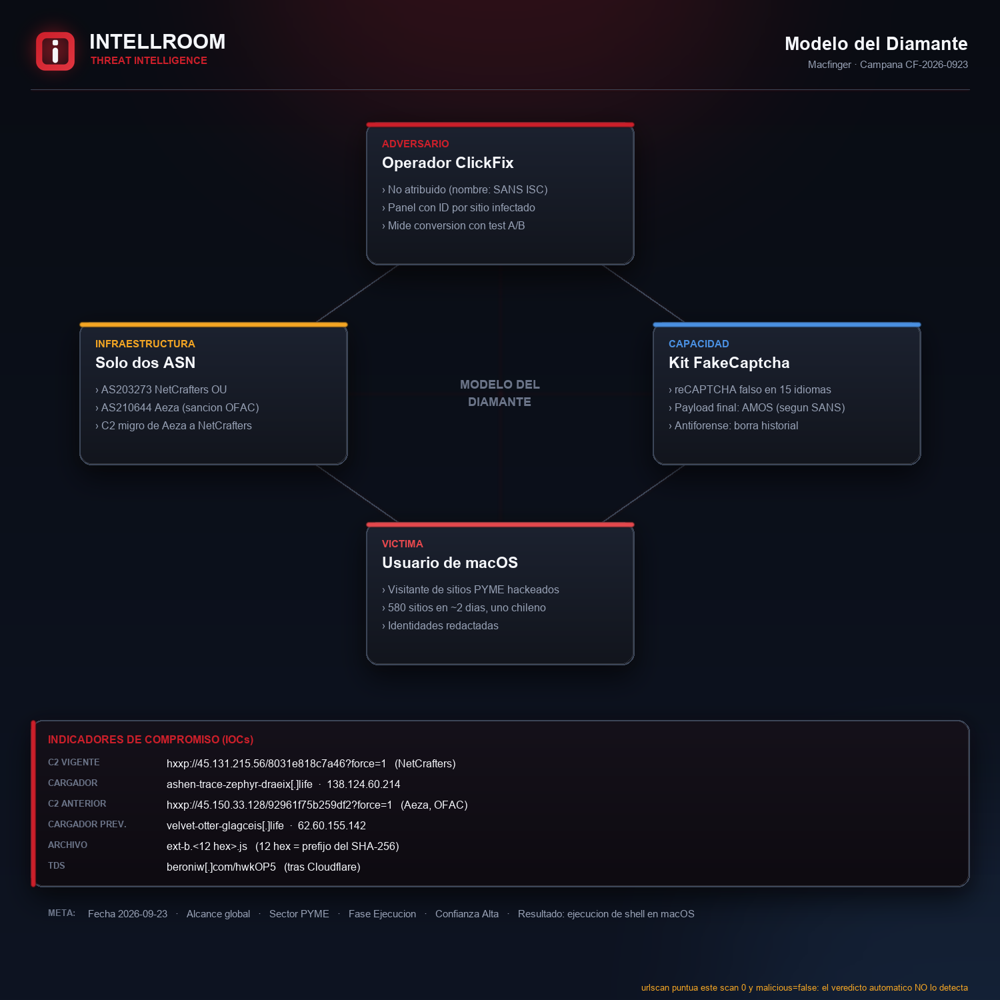

# Macfinger: ClickFix con reCAPTCHA falso contra macOS

**Técnica:** ClickFix, MITRE ATT&CK T1204.004 · **Objetivo:** usuarios de macOS · **Payload final:** variante de Atomic macOS Stealer (AMOS), según SANS · **TLP:CLEAR**
**Fuente primaria:** [SANS ISC, diario 33360](https://isc.sans.edu/diary/Macfinger+ClickFix+campaign/33360) (Brad Duncan, 22-09-2026) · **Contrastado y ampliado por Intellroom:** 23-09-2026

Una campaña masiva inyecta un cargador JavaScript en sitios WordPress de PYMEs de todo el mundo. El cargador muestra un **reCAPTCHA falso** sobre el sitio legítimo y convence al visitante de abrir la Terminal de macOS y pegar un comando que el propio kit copió al portapapeles. El comando descarga y ejecuta un script, **borra el historial y limpia la pantalla**, y termina mostrando en verde *"Verification successful"*.

Brad Duncan la nombró **Macfinger** en SANS ISC. Intellroom llegó a ella de forma independiente, pivoteando desde un **sitio chileno comprometido** (hay al menos seis), y la vinculó a la de SANS con un dato verificable: la URL del servidor de descarga dentro de la compilación vieja del payload es **idéntica** a una de las que publicó SANS.

## Lo que esta ficha agrega a lo ya publicado

- **El cargador rotó dos veces.** `velvet-otter-glagceis[.]life`, el único dominio que publicó SANS, fue reemplazado por **`ashen-trace-zephyr-draeix[.]life`** y horas después por **`misty-whirl-beacon-doa[.]life`**, que no aparecía en ningún reporte y **cayó en el ASN que esta ficha anticipa**. El identificador de la víctima no cambió.
- **Un servidor de descarga nuevo:** **`45[.]131[.]215[.]56`**, en la compilación vigente del payload.
- **Toda la infraestructura cabe en dos ASN**, la de SANS y la propia: **AS210644 Aeza Group**, sancionado por OFAC el 1-7-2025, y **AS203273 NetCrafters OU**. Entre una compilación y otra el servidor de descarga **migró de Aeza a NetCrafters**.
- **El nombre del archivo es un pivote exacto:** los 12 hexadecimales de `ext-b.4f9db6afd06a.js` son el **prefijo de su SHA-256**, verificado en las dos compilaciones. El propio servidor lo confirma con un 404: *"Extended script B version mismatch"*.
- **Test A/B:** `ext-b` significa *Extended script B*. El kit tira una moneda 50/50 entre dos payloads y mide la conversión.
- **Evade rastreadores de IA y de SEO,** no solo a Google: GPTBot, ClaudeBot, CCBot, AhrefsBot, SemrushBot. Buscarlo en Google no devuelve nada, y eso **no** prueba que un sitio esté limpio.
- **Un segundo inyector** independiente, con redirector propio (`beroniw[.]com`) que hace *cloaking*.
- **urlscan.io puntúa estos scans con score 0 y `malicious: false`.** Un triage que filtre por el veredicto automático deja pasar la campaña entera.

## Indicadores (resumen)

| Tipo | Valor | Acción |
|---|---|---|
| IP (C2 vigente) | `45[.]131[.]215[.]56` · AS203273 | Bloquear, **revisar a los 60 días** |
| IP (C2 anterior) | `45[.]150[.]33[.]128` · AS210644 Aeza | Bloquear, **revisar a los 60 días** |
| IP | `95[.]163[.]153[.]80:8133` · AS210644 | Bloquear (solo SANS, no verificado aquí) |
| Dominio | `misty-whirl-beacon-doa[.]life` · `ashen-trace-zephyr-draeix[.]life` · `velvet-otter-glagceis[.]life` · `skaedbraearaquiet[.]life` | Bloquear |
| Dominio | `beroniw[.]com` | Bloquear el dominio, **nunca** el rango de Cloudflare |
| Sitios que cargan el script | PYMEs comprometidas | **No bloquear:** son víctimas. Se avisa |
| ASN completos | AS203273, AS210644, Cloudflare | **No bloquear** el ASN, solo las IPs nombradas |

## Evidencia

| | |
|---|---|
|  |  |

## Documentos

- **[`Macfinger_ClickFix_macOS_23092026.txt`](Macfinger_ClickFix_macOS_23092026.txt)**: ficha completa. Qué agrega a SANS, cadena de ataque, comando reconstruido, infraestructura y migración, MITRE ATT&CK, qué **no** es un IOC, cómo enumerar víctimas y todo lo que no se pudo verificar.
- **[`iocs.txt`](iocs.txt)**: solo indicadores, con acción por línea, defanged. Distingue lo verificado por Intellroom de lo que solo publicó SANS.
- **[`evidencia_comparacion_compilaciones.txt`](evidencia_comparacion_compilaciones.txt)**: las dos compilaciones lado a lado y la migración del C2.
- **[`evidencia_comando_reconstruido.txt`](evidencia_comando_reconstruido.txt)**: el comando que se le hace pegar a la víctima y el método para desofuscarlo sin ejecutar el payload.
- **[`evidencia_404_version_mismatch.txt`](evidencia_404_version_mismatch.txt)**: por qué el nombre del archivo es el SHA-256.
- **[`evidencia_urlscan_busqueda.txt`](evidencia_urlscan_busqueda.txt)**: la consulta de enumeración y el perfil de las víctimas, sin identificarlas.
- **[`evidencia_loader_t.js.txt`](evidencia_loader_t.js.txt)**: el cargador tal como se sirvió, con el ID de la víctima redactado. Guardado como texto: no ejecutar.
- Sumas de verificación en **[`evidencia.sha256`](evidencia.sha256)**.

## Lo que no se pudo verificar ni se publica

- **El payload final.** No se descargó nada desde los servidores de descarga. La identificación como AMOS es de SANS.
- **Las huellas SHA-256 de archivos que publicó SANS.** Se reproducen con esa atribución, sin contrastar.
- **La variante A del test** (`ext.<hash>.js`). Solo se analizó la variante B.
- **Los payloads no se publican en este repositorio,** solo sus huellas.
- **Las víctimas.** Ningún sitio comprometido se nombra, y el identificador de víctima del cargador se redactó.

---
*Intellroom Threat Intelligence: SANS ISC como fuente primaria; urlscan.io (búsqueda y API), descarga directa de los scripts del cargador sin ejecutarlos, desofuscación aislada de las funciones puras del ofuscador, ipinfo.io, RDAP de RIPE, la designación de OFAC y la matriz de MITRE ATT&CK.*
