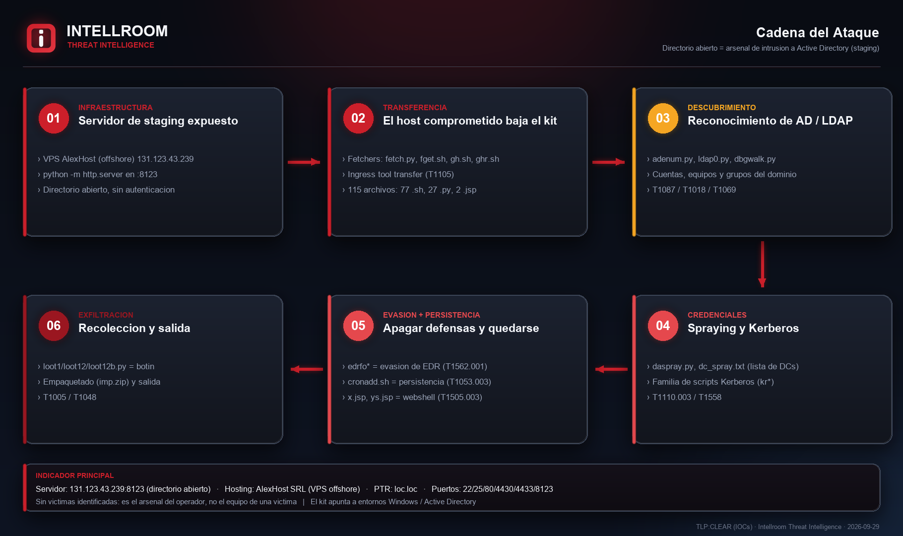
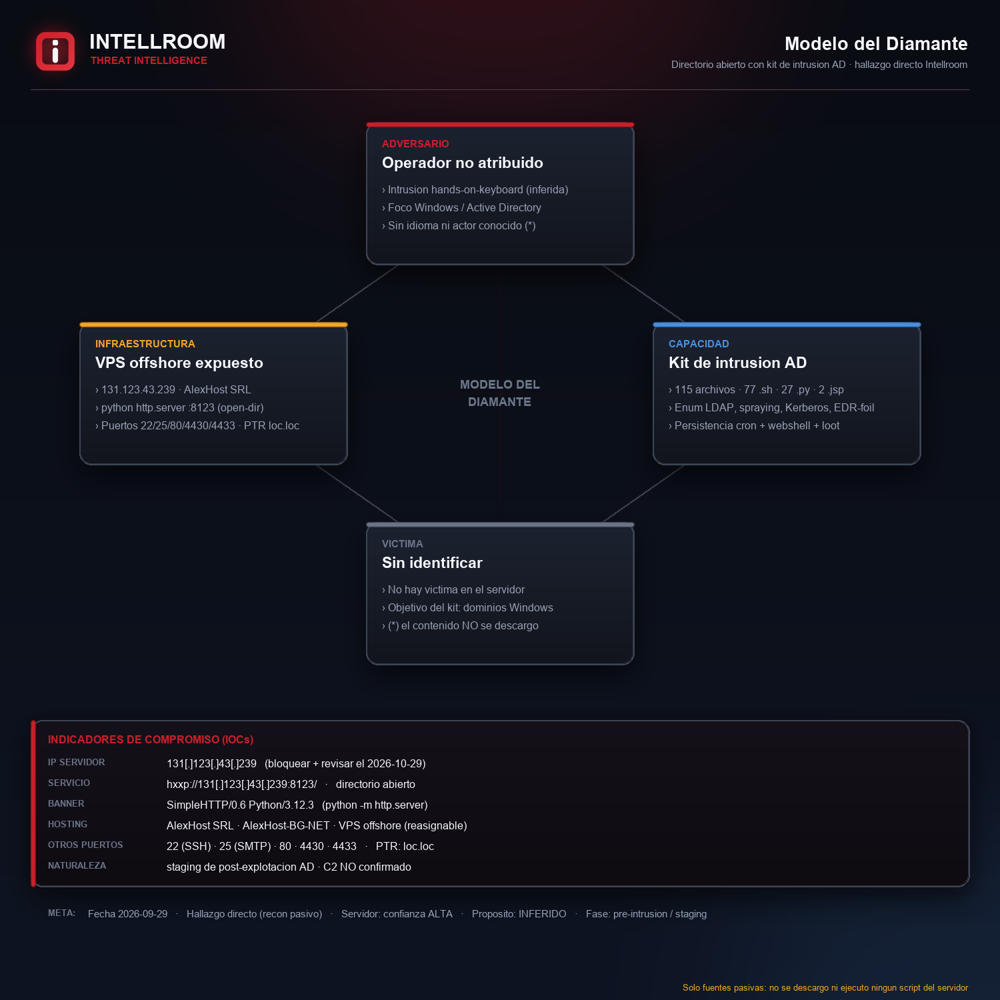
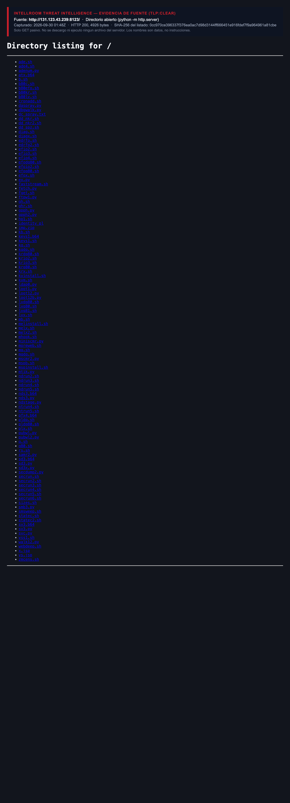

# Directorio abierto con kit de intrusión a Active Directory

**IP:** `131[.]123[.]43[.]239` · **Servicio:** `hxxp://131[.]123[.]43[.]239:8123/` (directorio abierto, `python -m http.server`) · **Hosting:** AlexHost SRL (VPS offshore, `AlexHost-BG-NET`) · **TLP:CLEAR**
**Fecha del hallazgo:** 29-09-2026 · **Origen:** hallazgo directo de Intellroom (recon) · **Contrastado:** 29-09-2026 (solo fuentes pasivas)

Un servidor expuesto publica **sin autenticación** un directorio abierto con **115 archivos** (77 `.sh`, 27 `.py`, 6 `.b64`, 2 webshells `.jsp`, un `identity_pl`, un `imp.zip`, un `dc_spray.txt`). Por la convención de nombres es el **arsenal de post-explotación de un operador para atacar entornos Windows / Active Directory**: enumeración de LDAP y del dominio, password/DC spraying, ataques Kerberos, evasión de EDR, persistencia por cron y webshells, y scripts de recolección (`loot`).

No es el equipo de una víctima: es la **caja de herramientas del atacante**, expuesta. No hay víctimas identificadas en el servidor y el propósito último (crimen, ejercicio autorizado, laboratorio) no se puede determinar desde afuera. Sin atribución a ningún actor ni campaña.

Intellroom **no descargó ni ejecutó ninguno de los 115 archivos**. Toda la lectura del kit es por el **nombre** del archivo (el listado público), nunca por su contenido. El servidor solo se consultó con `GET` pasivos a la raíz y con OSINT (WHOIS, RDAP, Shodan InternetDB, DNS inverso). El `PTR` es `loc.loc` (placeholder de un VPS self-managed) y Shodan lo etiqueta `open-dir` con puertos 22/25/80/4430/4433/8123.

**Por qué la acción no es solo "bloquear la IP":** es infraestructura de *staging* de la fase previa a un ataque. El valor defensivo está en cazar la **descarga** de estas herramientas desde la IP y la **secuencia** que el kit habilita dentro del AD (enum LDAP masivo, spraying al DC, Kerberos, apagado de EDR). La IP es de nube y se reasigna: el bloqueo lleva **fecha de revisión (2026-10-29)**.

## Correlación

Misma **familia** que otros casos ya publicados de infraestructura de atacante expuesta como directorio abierto sobre `python -m http.server`: [Erebus_C2_OpenDir](../Erebus_C2_OpenDir), [OpenDir_Operador_SurAsia](../OpenDir_Operador_SurAsia), [Pfcloud_OpenDir_Staging](../Pfcloud_OpenDir_Staging). Diferencia: aquellos alojaban C2/payloads; **este aloja un kit de intrusión interna a Active Directory**, un eslabón anterior de la cadena. Es correspondencia de modo de operación, no de identidad.

## Evidencia

| | |
|---|---|
|  |  |

## Documentos

- **[`OpenDir_AD_Toolkit_29092026.txt`](OpenDir_AD_Toolkit_29092026.txt)**: ficha completa con resumen, línea de tiempo, el kit por categoría (lectura por nombre), qué **no** es un IOC, evaluación de la fuente (Admiralty), MITRE ATT&CK verificado, ideas de caza, acciones y todo lo que no se pudo verificar.
- **[`iocs.txt`](iocs.txt)**: solo indicadores, con acción por línea (`[BLOQUEAR]` / `[DETECTAR]` / `[VIGILAR]` / `[NO ES UN IOC]`), defanged.
- **[`evidencia_recon_29092026.txt`](evidencia_recon_29092026.txt)**, **[`rdap_ripe.json`](rdap_ripe.json)** y **[`shodan_internetdb.json`](shodan_internetdb.json)**: evidencia cruda (GET, WHOIS/RDAP, Shodan InternetDB, DNS inverso) con hora UTC. Sumas en **[`evidencia.sha256`](evidencia.sha256)**.

## Lo que no se pudo verificar ni se publica

- **El contenido de los 115 archivos:** no se descargó ni se abrió nada; la función de cada script es inferencia por nombre.
- **Hashes/reputación de los archivos:** no se calcularon (habría requerido bajarlos).
- **Historial de exposición** del servidor y **qué corre en 4430/4433:** fuera del alcance pasivo.
- **Atribución:** ninguna. Sin actor, sin campaña, sin idioma.

---
*Intellroom Threat Intelligence: análisis 100% pasivo. Sin ningún archivo descargado ni ejecutado. Las ideas de detección son hipótesis: validar antes de desplegar.*
