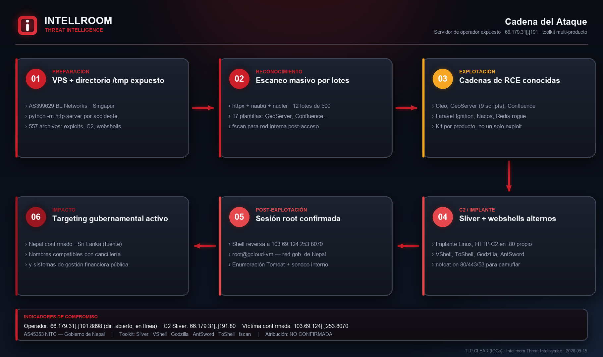
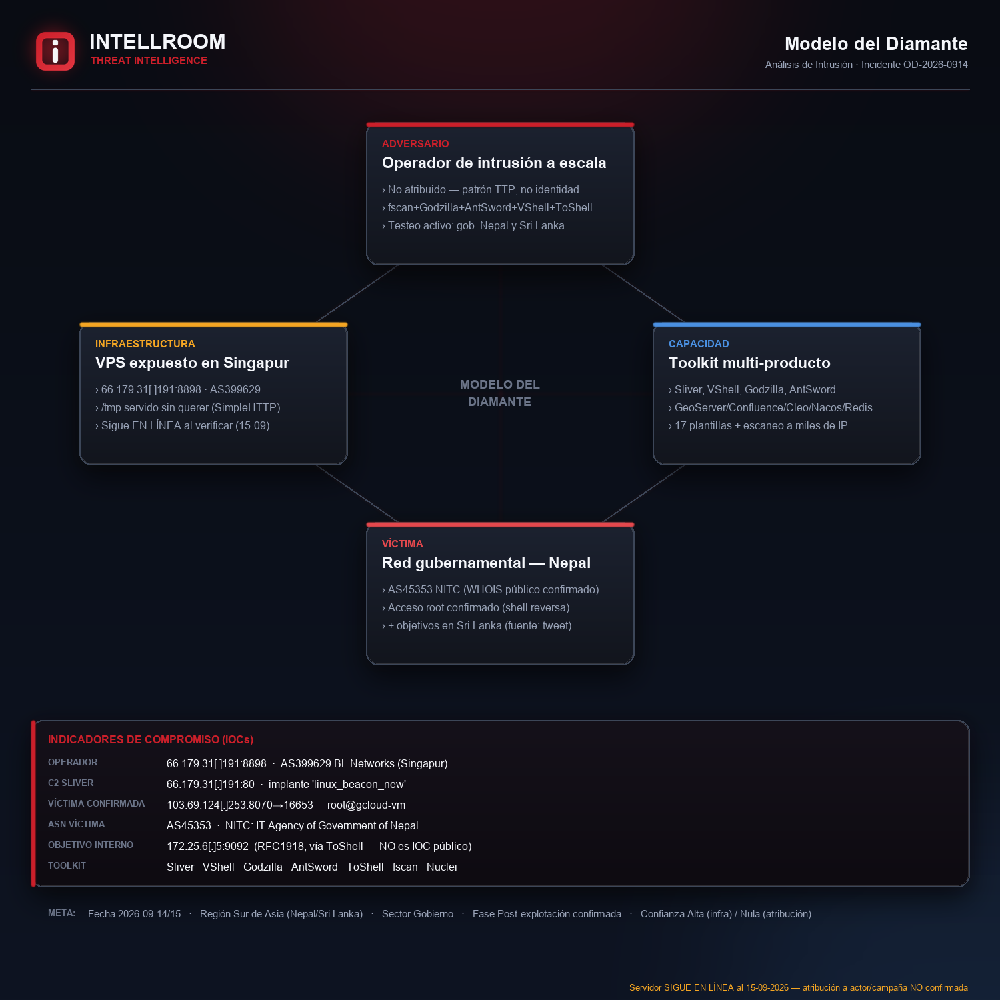
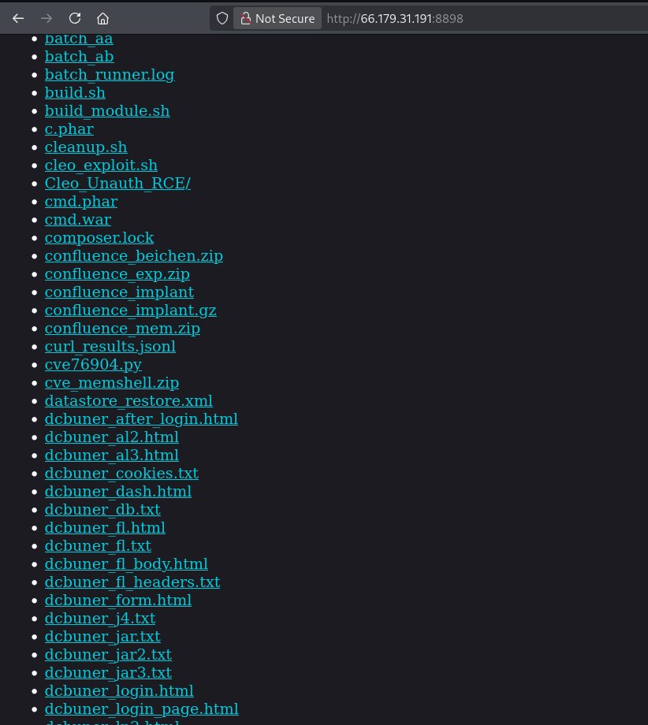
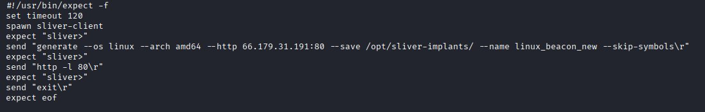
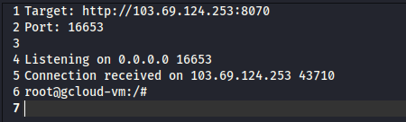

# Servidor de operador expuesto con toolkit ofensivo multi-producto

**IP:** `66.179.31[.]191:8898` · **Hosting:** AS399629 BL Networks (Singapur) · **TLP:CLEAR**
**Fecha del hallazgo:** 14-09-2026 · **Verificado por Intellroom:** 15-09-2026 (el directorio **sigue en línea**)

Un investigador independiente ([@Yusufcancakiir](https://x.com/Yusufcancakiir), cuenta verificada, [post original](https://x.com/Yusufcancakiir/status/2099547868906336273)) publicó el hallazgo de un directorio HTTP abierto que resultó ser el `/tmp` de un operador ofensivo, servido por accidente con `python -m http.server`. Intellroom lo verificó de forma **pasiva** (WHOIS/ASN público + una petición HTTP GET estándar a la raíz + verificación TCP — sin descargar ningún archivo) y amplió el hallazgo original.

## Qué hay ahí

- **557 entradas** en la raíz del directorio (169 carpetas / 388 archivos) — mucho más de lo visible en las capturas originales.
- **Toolkit de explotación multi-producto:** GeoServer (9 scripts), Confluence (implante + memshell), Cleo (RCE no autenticada), Laravel Ignition, Nacos, Redis (técnica de módulo malicioso), cámaras Hikvision.
- **17 plantillas de reconocimiento** por producto: CloudPanel, cPanel/WHM, DHIS2, Drupal, Grafana, Jenkins, Joomla, Koha, Laravel, LiteSpeed, Plesk, Prometheus, Tomcat, Webmin, WordPress, Zimbra.
- **Escaneo masivo orquestado:** httpx + naabu + nuclei sobre listas de objetivos partidas en 12 lotes de 500 (≥6.000 objetivos).
- **C2 y post-explotación confirmados:** un script automatiza Sliver C2 para generar un implante Linux con HTTP C2 en la misma IP (puerto 80); el operador también usa VShell, Godzilla, AntSword y ToShell.

## El hallazgo que confirma el objetivo

Un log de shell reversa registra una **conexión root exitosa** contra `103.69.124[.]253:8070`. Verificado de forma independiente por Intellroom vía WHOIS/ASN público: esa IP pertenece a **AS45353 — NITC, IT Agency of Government of Nepal**. Confirma, con una fuente distinta a la del investigador original, que el operador tiene acceso activo a infraestructura gubernamental.

El propio post original declara además *"evidencia de pruebas activas contra infraestructura gubernamental de la región, incluido Sri Lanka"*. Nombres de archivo en el listado son compatibles con sistemas de cancillería y de gestión financiera pública — **sin confirmar la entidad exacta**, se declara como hipótesis en la ficha completa.

**No se atribuye a ningún actor ni campaña conocida.** La combinación de herramientas (fscan + Godzilla + AntSword + VShell + ToShell) es un patrón de TTP ampliamente documentado, no una firma de atribución.

## Evidencia

| | |
|---|---|
|  |  |

**Capturas del post original** (@Yusufcancakiir, 14-09-2026):

| Directorio expuesto | Script de Sliver C2 | Shell reversa confirmada |
|---|---|---|
|  |  |  |

## Documentos

- **[`OpenDir_Operador_SurAsia_14092026.txt`](OpenDir_Operador_SurAsia_14092026.txt)** — ficha completa: resumen, línea de tiempo, el listado íntegro del directorio organizado por categoría, MITRE ATT&CK, acciones recomendadas y todo lo que **no** se pudo verificar.
- **[`iocs.txt`](iocs.txt)** — solo indicadores, con acción por línea (`[BLOQUEAR]` / `[VIGILAR]` / `[PARCHEAR]` / `[DETECTAR]` / `[NO ES IOC]`), defanged.
- **[`listado_directorio_15092026.txt`](listado_directorio_15092026.txt)** — el listado crudo de las 557 entradas, capturado el 15-09-2026.

## Lo que no se publica

Una cuenta sin verificar respondió al post original con una captura de un panel de C2 con ~100 hosts registrados. **No se confirma** que corresponda a este mismo servidor (ninguna IP ni URL lo conecta), así que **no se sube esa imagen ni sus IOCs** — publicarla expondría hosts de terceros no verificados. Detalle en la sección 5-bis de la ficha completa.

---
*Intellroom Threat Intelligence — análisis pasivo, sin ninguna interacción intrusiva con el objetivo ni con la red de la víctima más allá de un handshake TCP de conectividad.*
