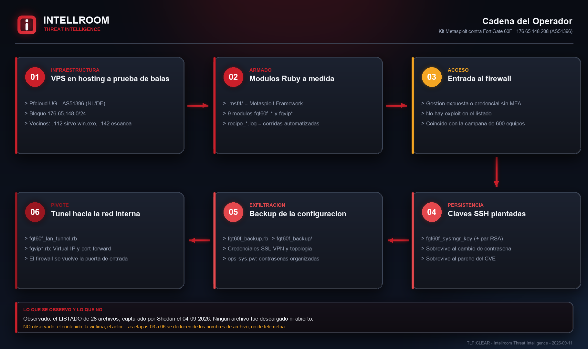
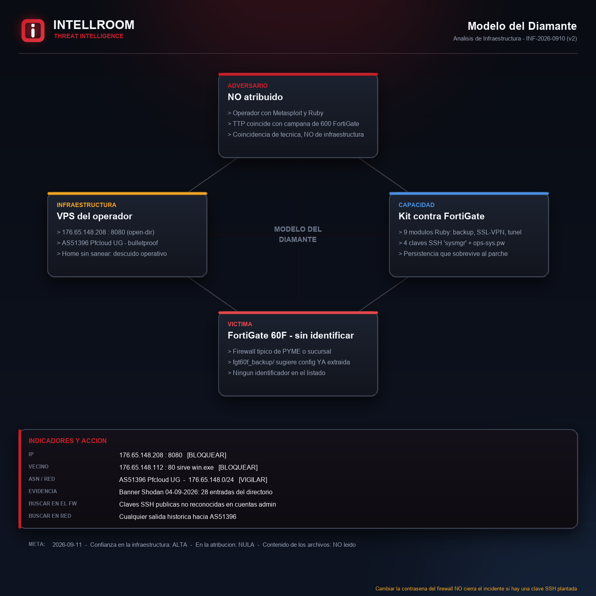
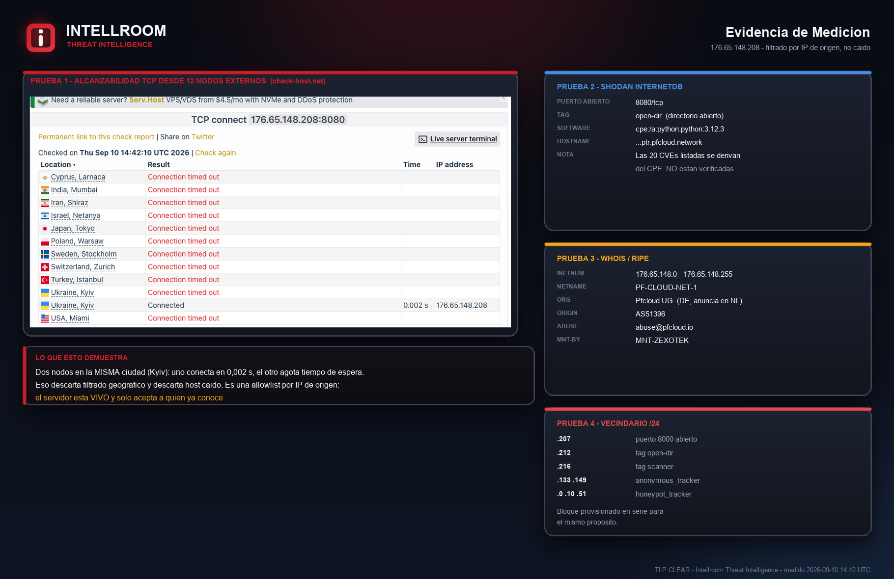
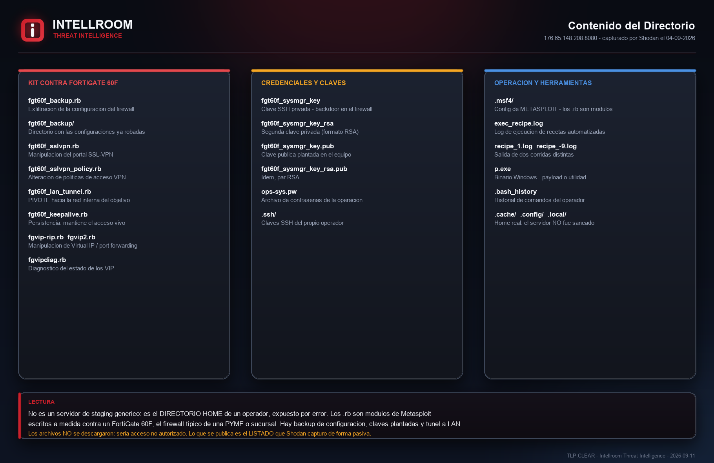

# Servidor de operador con kit contra FortiGate 60F

**IP:** `176.65.148[.]208:8080` · **Hosting:** AS51396 Pfcloud UG (bulletproof) · **TLP:CLEAR**
**Fecha:** 10-09-2026 · **Actualizado:** 11-09-2026 (v3)

Directorio HTTP abierto detectado vía Shodan, que resultó ser el **home de un operador ofensivo**, no un servidor de staging genérico: 28 entradas centradas en un kit de **9 módulos Ruby de Metasploit escritos a medida contra un FortiGate 60F** (backup de configuración, manipulación de SSL-VPN, túnel a la LAN, persistencia y manejo de Virtual IP), más 4 archivos de clave SSH nombrados `sysmgr` y el directorio `.msf4/` (configuración de Metasploit Framework).

## Lo que confirma la investigación

- El home está **sin sanear** (`.bash_history`, `.profile`, `.cache/`) — el operador dejó expuesto su directorio de trabajo, no una infraestructura de distribución planificada.
- Los 4 archivos `fgt60f_sysmgr_key*` son un par de claves SSH: la lectura más directa es **persistencia por clave pública** en el administrador del FortiGate, que sobrevive a un cambio de contraseña y a un parche.
- Una prueba de alcanzabilidad contra 12 nodos externos encontró una **allowlist por IP de origen** (11 de 12 nodos dan timeout, uno conecta en 0,002s).
- **Corroboración independiente** de un investigador externo ([@Yusufcancakiir](https://x.com/Yusufcancakiir), 09-09-2026): confirma la clasificación "operator/staging box, no C2", agrega los CVE que explota el kit (CVE-2018-13379, CVE-2022-40684), un componente QNAP no visible en el listado original, y evidencia de robo dirigido a documentos financieros. Fuente externa, no verificada de primera mano por Intellroom — ver sección 5-bis de la ficha.

**No se atribuye a ningún actor.** El kit encaja por TTP con la campaña asistida por IA de enero-febrero 2026 que comprometió +600 FortiGate en +55 países, pero no hay solapamiento de IP, dominio ni muestra.

## Evidencia

| | |
|---|---|
|  |  |
|  |  |

## Documentos

- **[`Pfcloud_OpenDir_Staging_10092026.txt`](Pfcloud_OpenDir_Staging_10092026.txt)** — ficha completa (v3): resumen, línea de tiempo, listado de 28 entradas, medición de alcanzabilidad, cruce con campañas conocidas, corroboración externa, MITRE ATT&CK y acciones recomendadas.
- **[`iocs.txt`](iocs.txt)** — indicadores con acción por línea.
- **[`evidencia_hashes.txt`](evidencia_hashes.txt)** / **[`evidencia_shodan_banner.json`](evidencia_shodan_banner.json)** / **[`listado_original.html`](listado_original.html)** — evidencia cruda de Shodan que sostiene la ficha.

## Lo que no se pudo verificar

El **contenido** de los archivos (solo se tiene el listado de nombres capturado por Shodan; ningún archivo fue descargado) y **ningún hash de muestra** en ninguna fuente pública consultada (OTX, ThreatFox, VirusTotal). Detalle completo en la sección 9 de la ficha.

---
*Intellroom Threat Intelligence — análisis pasivo: solo WHOIS/DNS, peticiones HTTP estándar, verificación TCP y consulta a la API de Shodan.*
