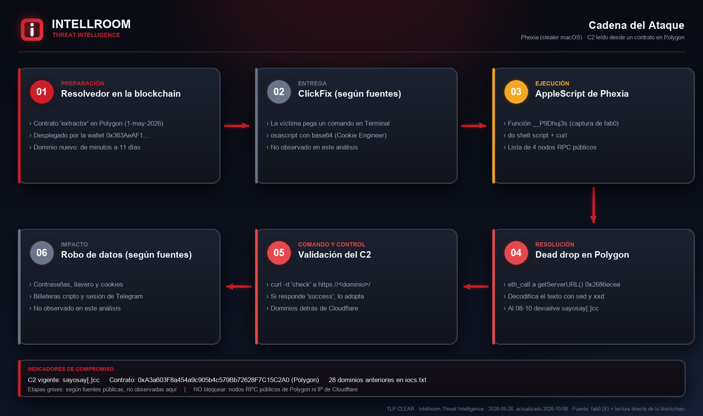
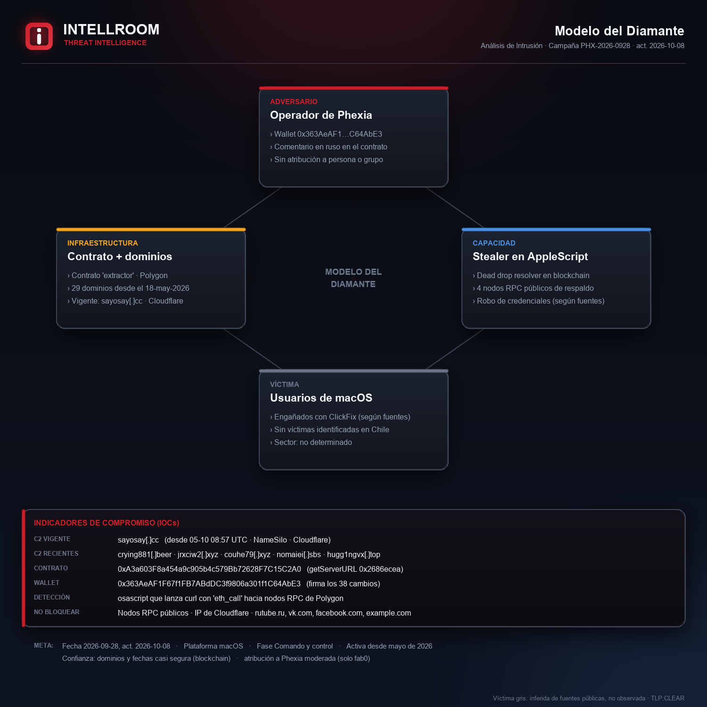
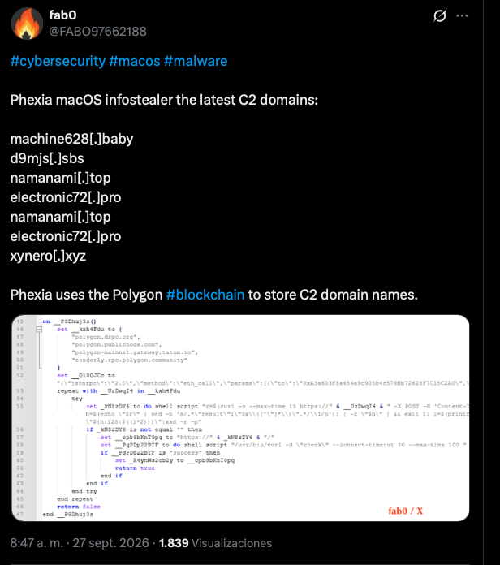
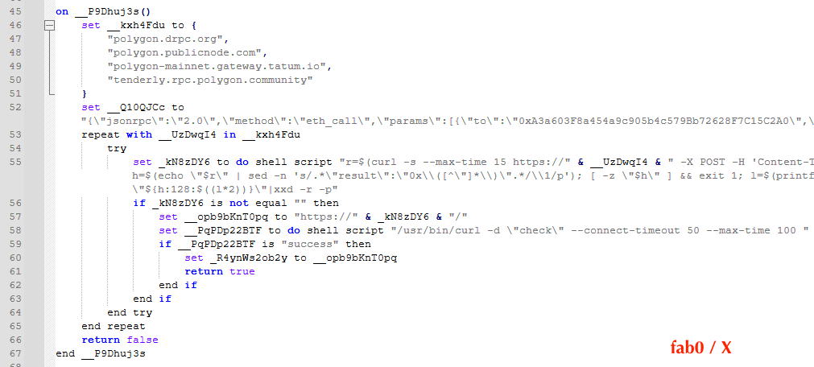
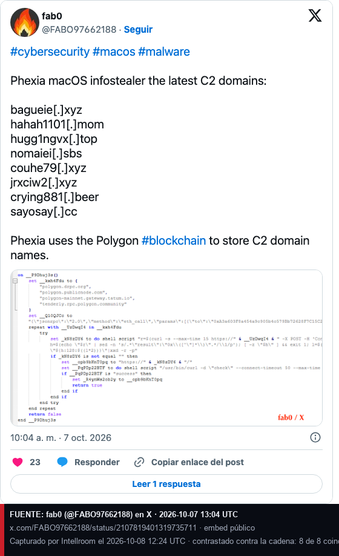

# Phexia: el stealer de macOS que lee su C2 desde un contrato en Polygon

**Familia:** Phexia, infostealer para macOS en AppleScript · **Entrega:** ClickFix, según fuentes públicas · **Resolución del C2:** contrato inteligente en Polygon (MITRE ATT&CK T1102.001) · **TLP:CLEAR**
**Fuente primaria:** fab0 ([@FABO97662188](https://x.com/FABO97662188)) en X, 27-09-2026 · **Contrastado y ampliado por Intellroom:** 28-09-2026

Phexia no trae escrito el dominio de su servidor de control. El AppleScript le pregunta a un **contrato inteligente en Polygon**, a través de cuatro nodos RPC públicos, cuál es el dominio del momento. Para mover el C2, el operador escribe un valor nuevo con una sola transacción, así que tumbar un dominio no basta: el operador escribe otro y el malware lo lee en su próxima consulta.

fab0 publicó la lista de dominios recientes y una captura del código. Intellroom leyó el contrato directamente en la blockchain, **sin enviar una sola petición a los C2**, y reconstruyó su historia completa. Lo que le da resiliencia al operador también lo expone: cada cambio queda público, firmado y con fecha.

## Actualización 08-10-2026: siete C2 nuevos y rotación más rápida

El 07-10 fab0 publicó los últimos ocho valores del contrato ([post](https://x.com/FABO97662188/status/2107819401319735711)). Intellroom reconstruyó **todas** las transacciones de la wallet desde el 28-09 y la lista **coincide 8 de 8**, en el mismo orden. El **C2 vigente es `sayosay[.]cc`**, escrito el **05-10 a las 08:57 UTC**.

- **7 dominios nuevos:** `hahah1101[.]mom`, `hugg1ngvx[.]top`, `nomaiei[.]sbs`, `couhe79[.]xyz`, `jrxciw2[.]xyz`, `crying881[.]beer` y `sayosay[.]cc`. Total histórico: **38 escrituras y 29 dominios**.
- **La rotación se aceleró:** en septiembre cada valor duraba de 3 a 11 días; entre el 30-09 y el 05-10 duró de **6 minutos** (`crying881[.]beer`) a poco más de 2 días.
- **Los dominios se registran casi siempre de a pares**, entre 5 minutos y casi 5 días antes de usarse; 7 de 8 en NameSilo, todos con DNS de Cloudflare.
- **Lección propia:** el vigía diario de Intellroom registró 3 de los 7: falló el 2, 3 y 4-10 (el equipo despertó sin red) y, aun sin fallas, una lectura al día no ve valores que duran horas. Para el historial hay que leer las transacciones, no solo el valor del momento.

## Lo que esta ficha agrega a lo ya publicado

- **El C2 vigente es `bagueie[.]xyz`**, escrito el **28-09 a las 06:15 UTC**, después del post de fab0. No estaba en su lista.
- **La historia completa del contrato:** desplegado el **1-5-2026**, escrito **31 veces**, con **22 dominios** con forma de C2 y 4 valores de prueba (sitios legítimos). Cada fila lleva el hash de su transacción, para que cualquiera la verifique.
- **La lista de fab0 coincide 1 a 1** con la blockchain, en orden y con sus repetidos: el 22-09 el operador alternó entre `electronic72[.]pro` y `namanami[.]top` tres veces en 34 minutos.
- **La wallet del operador**, `0x363AeAF1F67f1FB7ABdDC3f9806a301f1C64AbE3`, desplegó el contrato y firma cada cambio. Los dominios rotan; la wallet no.
- **Solo 5 de los 22 dominios resuelven hoy.** Tres de los cinco de la lista de fab0 ya están suspendidos por su registro.
- **Cómo leer el C2 vigente sin ejecutar el malware:** una consulta a un nodo público de Polygon (sección 5 de la ficha).
- **El código fuente del contrato está verificado:** se llama `extractor`, guarda el C2 en `serverURL` y su primera línea es un **comentario en ruso** («el mismo contrato que arriba»). El valor inicial del despliegue fue `vk.com`. Es una señal, no una atribución.

## Indicadores (resumen)

| Tipo | Valor | Acción |
|---|---|---|
| Dominio (C2 vigente) | `sayosay[.]cc` (desde el 05-10) | Bloquear |
| Dominios (28 anteriores) | Ver `iocs.txt` | Bloquear; los caídos sirven para buscar en logs desde el 18-05 |
| Dominio | `johncon[.]my` | **Vigilar, no bloquear a ciegas:** puede ser de un tercero |
| Contrato y wallet | `0xA3a603F8…7C15C2A0` · `0x363AeAF1…C64AbE3` | Detectar y vigilar en la blockchain |
| Nodos RPC públicos de Polygon | `polygon.drpc.org` y otros tres | **No bloquear:** son legítimos. Detectar quién los consulta |
| IPs de los C2 | Cloudflare | **No bloquear** la IP ni el rango, solo el dominio |

## Evidencia

| | |
|---|---|
|  |  |
|  |  |
|  | |

*Capturas 03 y 04: post original de fab0 ([@FABO97662188](https://x.com/FABO97662188)) en X, 27-09-2026; captura 05: su post del 07-10-2026. Reproducidos como fuente con su crédito.*

## Documentos

- **[`Phexia_macOS_Polygon_C2_28092026.txt`](Phexia_macOS_Polygon_C2_28092026.txt)**: ficha completa. Qué agrega a lo publicado, línea de tiempo, indicadores con estado DNS, qué **no** es un IOC, cómo funciona el resolvedor, patrón de rotación, MITRE ATT&CK y todo lo que no se pudo verificar.
- **[`iocs.txt`](iocs.txt)**: solo indicadores, con acción por línea, defanged.
- **[`evidencia_consulta_contrato_28092026.txt`](evidencia_consulta_contrato_28092026.txt)**: la petición y la respuesta crudas del `eth_call` en dos nodos independientes, con hora. Es la misma consulta que hace el malware.
- **[`evidencia_contrato_codigo_28092026.txt`](evidencia_contrato_codigo_28092026.txt)**: el código fuente verificado, los selectores comprobados con Keccak-256 y el bytecode desplegado con su SHA-256.
- **[`evidencia_historial_contrato_28092026.txt`](evidencia_historial_contrato_28092026.txt)**: las 31 escrituras del contrato con fecha, valor y hash de transacción.
- **[`evidencia_wallet_operador_28092026.txt`](evidencia_wallet_operador_28092026.txt)**: las 35 transacciones de la wallet del operador.
- **[`evidencia_dns_rdap_28092026.txt`](evidencia_dns_rdap_28092026.txt)**: DNS de los 22 dominios y RDAP de los seis más recientes, con hora.
- **[`evidencia_historial_contrato_08102026.txt`](evidencia_historial_contrato_08102026.txt)** y **[`evidencia_dns_rdap_08102026.txt`](evidencia_dns_rdap_08102026.txt)**: las 7 escrituras nuevas leídas por JSON-RPC (respuestas crudas) y DNS y RDAP de los 8 dominios recientes, con hora.
- Sumas de verificación en **[`evidencia.sha256`](evidencia.sha256)**.

## Lo que no se pudo verificar ni se publica

- **La atribución a Phexia es de fab0.** Encaja con lo publicado sobre la familia, pero Intellroom no tuvo una muestra.
- **La ruta del C2 después de `check`:** la captura la corta.
- **Que cada dominio histórico haya respondido como C2.** Se afirma que fue el valor del contrato.
- **No hay datos de que la campaña apunte a Chile** ni a un sector en particular.

---
*Intellroom Threat Intelligence: fab0 como fuente primaria; estado del contrato leído con `eth_getCode` y `eth_call` en nodos públicos de Polygon; código fuente verificado e historial de transacciones en la API de Blockscout; RDAP y DNS de cada dominio; cystack y Cookie Engineer para el contexto de la familia.*
