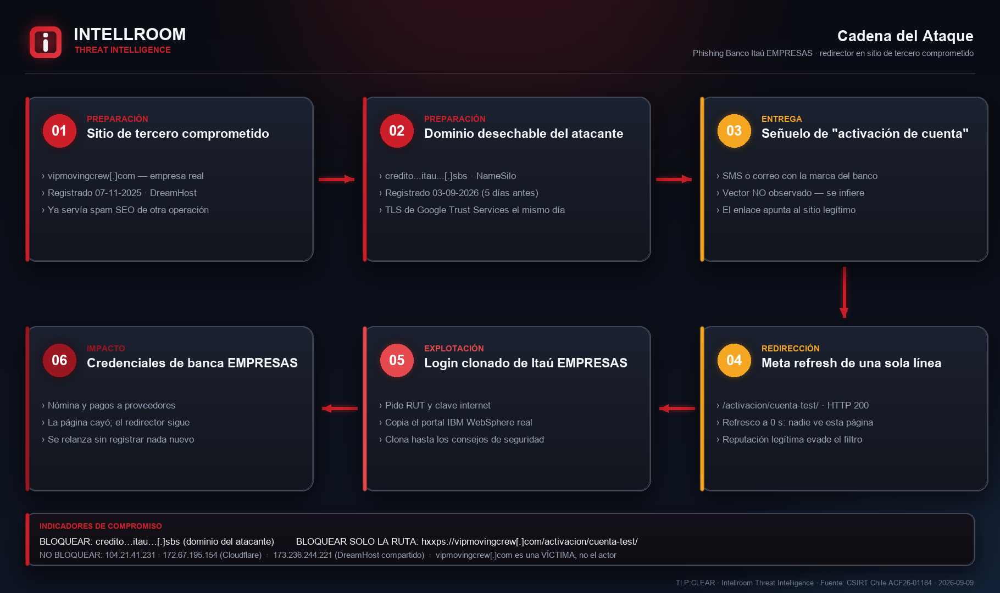
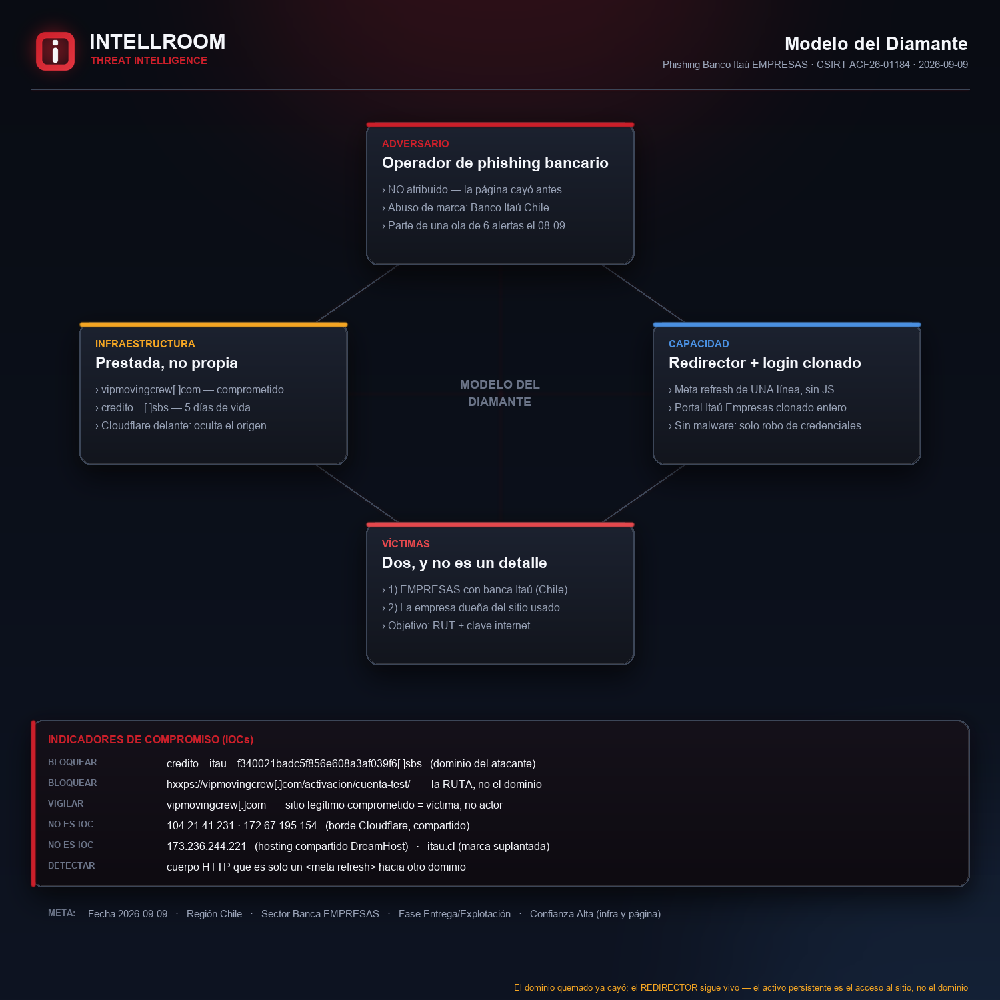
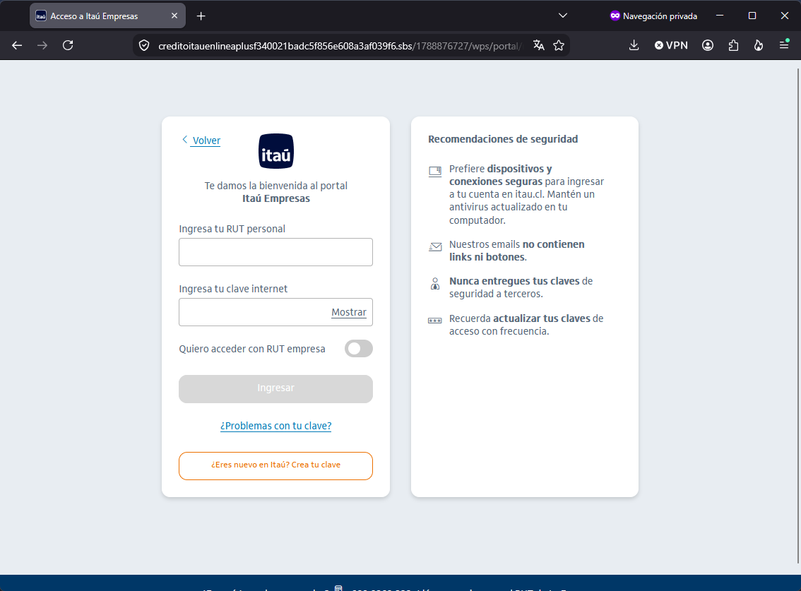

# Phishing Banco Itaú Chile → redirector alojado en el sitio de un tercero

**Fecha:** 2026-09-09 · **TLP:CLEAR** · Intellroom CTI
**Fuente primaria:** CSIRT Nacional de Chile — alerta [`ACF26-01184`](https://csirt.gob.cl/alertas/acf26-01184/) (2026-09-08)

Campaña de robo de credenciales que suplanta el portal de **banca EMPRESAS de Banco Itaú
Chile**. La víctima no llega directo a la página falsa: primero pasa por el sitio web de una
empresa sin relación con el fraude, que los atacantes tienen comprometido y usan como trampolín.

**El objetivo son cuentas de empresa, no de personas naturales** — confirmado en la captura
oficial del CSIRT. Eso sube el impacto: una cuenta de banca empresa mueve nómina, pagos a
proveedores y montos que una cuenta personal no.

Lo que distingue a esta campaña no es la página falsa — es de kit y ya cayó — sino la
**estructura** de la cadena:

1. **El primer salto tiene reputación legítima.** `vipmovingcrew[.]com` es un dominio real,
   registrado en noviembre de 2025 en DreamHost. Un filtro que puntúa por antigüedad y
   reputación de dominio lo deja pasar sin objeciones.
2. **El segundo salto es desechable.** El dominio `.sbs` se registró **cinco días antes** de
   la alerta, con certificado emitido el mismo día y Cloudflare delante.

> ⚠️ Análisis por **OSINT pasivo y peticiones HTTP sin ejecución de JavaScript**.
> **No se envió ningún dato a la infraestructura del atacante.**

---

## El hallazgo que cambia la respuesta

Al verificarla el 09-09-2026, **la página falsa ya estaba caída y el redirector seguía en pie**:

| Componente | Estado al 2026-09-09 |
|---|---|
| Página falsa (`.sbs`, ruta del IOC) | HTTP **404** — caída |
| Raíz del dominio `.sbs` | HTTP **302** |
| **Redirector en el sitio comprometido** | HTTP **200 — vivo** |

El activo persistente del atacante **no es el dominio quemado, es el ACCESO** al sitio de
terceros. Desde ahí reapunta el `meta refresh` a una página nueva en segundos, sin tocar el
enlace que ya repartió por SMS o correo. **Bloquear solo el `.sbs` no cierra esta campaña.**

---

## Cadena del ataque



El redirector es un HTML de **una sola línea**, sin JavaScript:

```html
<meta http-equiv='Refresh' content='0; URL=hxxps[:]//credito…[.]sbs/'>
```

Y la ruta de destino no es decorativa: `/wps/portal/newiol/web/login/p/z1/` **replica la
estructura real del portal IBM WebSphere** que usa la banca. Quien mire la URL con cierto
criterio reconoce una ruta "correcta" y baja la guardia.

## Modelo del Diamante



## La página falsa — captura oficial del CSIRT



*Publicada por el CSIRT en la alerta. Navegación privada, formulario vacío, sin datos
personales de ninguna persona. Intellroom no la reprodujo: al momento del análisis la página
ya estaba caída.*

Tres cosas que la captura confirma y que antes eran inferencia:

1. **Es banca EMPRESAS.** Título de pestaña *"Acceso a Itaú Empresas"*, encabezado *"Te damos
   la bienvenida al portal Itaú Empresas"* e interruptor *"Quiero acceder con RUT empresa"*.
2. **Los campos que captura:** *"Ingresa tu RUT personal"* y *"Ingresa tu clave internet"*.
   Se leen en el formulario, no se dedujeron.
3. **El kit clonó también el panel "Recomendaciones de seguridad" del banco real** — que en la
   propia página falsa aconseja *"Nuestros emails no contienen links ni botones"* y *"Nunca
   entregues tus claves de seguridad a terceros"*. La página que roba la clave muestra el
   consejo que la desmiente. Es copia literal del sitio legítimo, no descuido del atacante.

Y en la barra de direcciones se ve el dominio completo: es el mismo `.sbs` del indicador.

---

## Regla de oro: aquí hay DOS víctimas

La empresa dueña de `vipmovingcrew[.]com` **es una víctima, no el actor**. Por eso:

- **Se bloquea la RUTA** `/activacion/cuenta-test/`, **nunca el dominio completo** — bloquearlo
  castiga a su dueño y envejece mal: en cuanto limpie el sitio, el bloqueo solo estorba.
- **Las IP no se bloquean jamás.** `104.21.41.231` y `172.67.195.154` son borde de **Cloudflare**;
  `173.236.244.221` es hosting **compartido** de DreamHost. Bloquear cualquiera tumba a miles
  de terceros sin relación.

El propio CSIRT aplica el mismo criterio y lo declara en la alerta: no publica IP de Google,
Cloudflare, Microsoft, Digital Ocean u Oracle *"puesto que podemos ocasionar falsos positivos"*.

> 🔎 **El sitio está tomado por al menos dos operaciones distintas.** Además del redirector,
> su raíz sirve spam SEO inyectado (casinos y contenido adulto, en indonesio) junto al contenido
> original en español. Patrón de acceso comprometido revendido o alquilado.

---

## Dos límites que la lista de bloqueo no cubre

**La ruta publicada puede no ser la de producción.** Se llama `cuenta-test` y `/activacion/`
devuelve 404, así que no hay listado de directorio: pueden coexistir otras rutas activas con
nombre distinto en el mismo sitio.

**El vector de entrega no consta.** El CSIRT no publica el SMS ni el correo original. Si aparece,
ese remitente es el indicador que más vale y no está en esta ficha.

Por eso `iocs.txt` incluye detecciones **por comportamiento**, que sobreviven a la rotación:
una respuesta HTTP cuyo cuerpo entero es un `meta refresh` hacia otro dominio es el patrón,
independiente del dominio del día.

---

## Contexto: no es un caso aislado

El CSIRT publicó **seis alertas de campaña fraudulenta contra marcas chilenas el mismo
08-09-2026** (Itaú, MetLife, Líder, Outlook; más GTD Telsur y Poder Judicial esa semana).

El hilo común no es un actor identificado: es el **método** — alojar el fraude en infraestructura
de terceros legítimos (Firebase, Azure Storage, MediaFire, acortadores y sitios comprometidos en
Chile, México y Argentina). Eso hace que **la lista de bloqueo sea el control equivocado** para
casi todas, y que la detección por comportamiento y el monitoreo de abuso de marca sean los que
sí escalan.

---

## Archivos

| Archivo | Contenido |
|---|---|
| [`iocs.txt`](iocs.txt) | Indicadores para bloqueo rápido, **con la acción en cada línea**: `[BLOQUEAR]` · `[VIGILAR]` · `[NO ES IOC]` · `[DETECTAR]` |
| [`BancoItau_Redirector_Comprometido_09092026.txt`](BancoItau_Redirector_Comprometido_09092026.txt) | Ficha completa: resumen, cadena, línea de tiempo, **"lo que NO es un IOC"**, MITRE ATT&CK, recomendaciones, valoración y limitaciones |
| [`03_evidencia_tecnica.txt`](03_evidencia_tecnica.txt) | Mediciones crudas y reproducibles: DNS, WHOIS, certificado TLS, códigos HTTP, contenido literal del redirector |
| `01_flujo_ataque.png` · `02_modelo_diamante.png` | Diagramas de Intellroom |
| `04_evidencia_csirt_pagina_falsa.png` | Captura de la página falsa **publicada por el CSIRT** en la alerta ([fuente](https://csirt.gob.cl/alertas/acf26-01184/)) |

**Todos los indicadores van defanged.** Al aplicarlos: reemplazar `[.]` → `.` y `hxxp` → `http`.

---

## MITRE ATT&CK

| Técnica | Uso en esta campaña |
|---|---|
| `T1584.004` Compromise Infrastructure: Server | **Técnica central** — el sitio de un tercero como primer salto |
| `T1583.001` Acquire Infrastructure: Domains | Registro del `.sbs` cinco días antes |
| `T1608.005` Stage Capabilities: Link Target | El `meta refresh` depositado en el sitio comprometido |
| `T1665` Hide Infrastructure | Cloudflare delante del origen |
| `T1656` Impersonation | Uso no autorizado de la imagen corporativa del banco |
| `T1566.002` Phishing: Spearphishing Link | Entrega — *inferida*, no observada |
| `T1598.003` Phishing for Information: Spearphishing Link | Captura de credenciales |

---

*Intellroom — Cyber Threat Intelligence · [intellroom.com](https://intellroom.com)*
