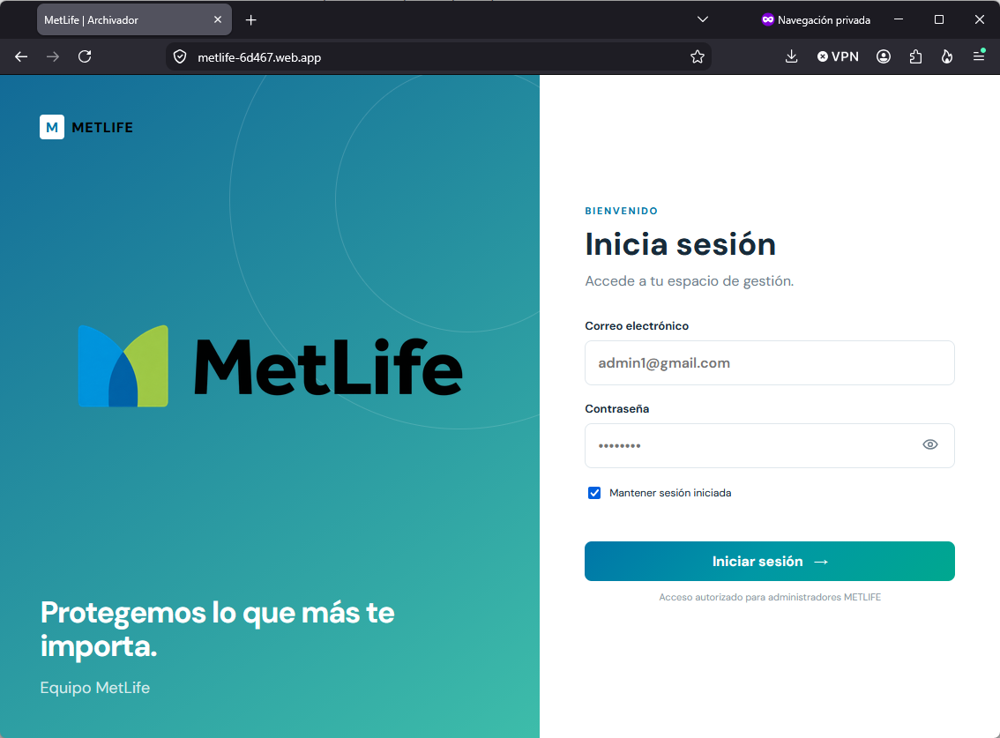
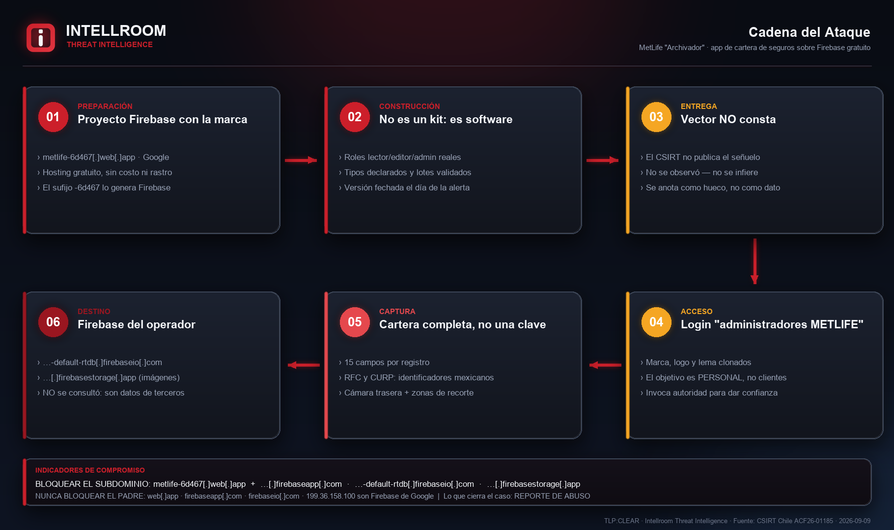
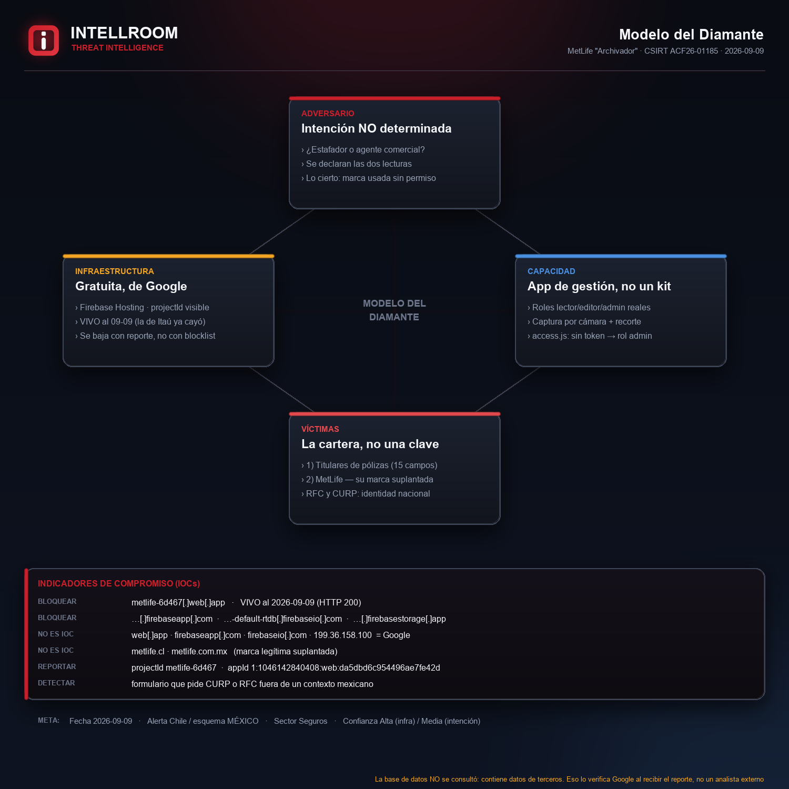

# "MetLife | Archivador": una cartera de seguros completa sobre Firebase gratuito

**Fecha:** 2026-09-09 · **TLP:CLEAR** · Intellroom CTI
**Fuente primaria:** CSIRT Nacional de Chile — alerta [`ACF26-01185`](https://csirt.gob.cl/alertas/acf26-01185/) (2026-09-08)

El CSIRT publicó esta alerta como "Campaña Fraudulenta" con **un solo indicador**. Al
examinarlo apareció algo que la alerta no alcanza a decir, y que cambia la respuesta.

**No es un clon de un portal público para robar la clave de un cliente.** Es una
**aplicación de gestión de cartera** de seguros, funcional y bien construida: roles reales
vía Firebase custom claims, validación de datos con tipos declarados, captura de documentos
con la **cámara del teléfono**, buscador "por póliza o nombre". Sus módulos llevan la cadena
de versión `?v=20260908-grupos` — **se seguía desarrollando el mismo día de la alerta**.

Y el pie del formulario dice, textual: *"Acceso autorizado para administradores METLIFE"*.
**El público objetivo no son clientes: es personal.**

> ⚠️ Análisis por **OSINT pasivo** sobre ficheros estáticos públicos del sitio, **sin ejecutar
> JavaScript, sin autenticarse y sin enviar ningún dato**. La base de datos **no se consultó**
> — decisión deliberada, ver más abajo.

---

## La página, capturada por el CSIRT



*Publicada por el CSIRT en la alerta. Navegación privada, formulario vacío, sin datos
personales de ninguna persona.*

## Cadena



## Modelo del Diamante



---

## Dos lecturas, y esta ficha no elige por conveniencia

El CSIRT lo clasificó como campaña fraudulenta. Lo observado admite dos lecturas:

**(A) Herramienta de un agente o equipo comercial, con la marca usada sin autorización.**
Es lo que más se parece a lo observado. Nadie invierte en un esquema de campos de negocio tan
específico (suma asegurada, prima excedente, medio, vendida, estatus), en tipos declarados, en
roles con custom claims y en un modo *development* con configuración demo, **solo para robar
una contraseña**. Eso es software que alguien usa para trabajar.

**(B) Phishing dirigido a personal de MetLife** para que vuelque su cartera. A favor: el abuso
de marca, el hosting gratuito y que el pie invoque autoridad.

**Lo que no cambia en ninguna de las dos:** hay datos personales de clientes de seguros en un
proyecto Firebase de un tercero, bajo una marca usada sin permiso. Si (A) es cierta, el
problema no es menor — es una fuga de cartera hacia infraestructura no autorizada, y
probablemente **ninguno de esos titulares lo sabe**.

---

## 🔴 El esquema es mexicano, no chileno

La aplicación pide **RFC** (Registro Federal de Contribuyentes) y **CURP** (Clave Única de
Registro de Población). Los dos son identificadores **de México**. **No existe campo RUT.**

La alerta la emite el CSIRT de Chile, pero el producto está diseñado para el mercado mexicano.
Con lo observado no se puede decidir por qué, y no se afirma.

> **Consecuencia práctica:** si esto llega a una organización chilena, un formulario que pide
> CURP y RFC **es en sí mismo la señal de alarma** — son campos sin ningún sentido en un
> trámite chileno. Está como regla de detección en `iocs.txt`.

---

## Qué se captura por registro

| | | |
|---|---|---|
| Póliza | Nombre completo | Negocio |
| Suma asegurada | Prima | Prima excedente |
| Medio | Vendida | Estatus |
| Teléfono | Fecha | **RFC** |
| **CURP** | Correo electrónico | Lugar de trabajo |

Más **documentos digitalizados con la cámara trasera** del teléfono, con zonas de recorte.
Lo que está en juego no es una credencial suelta: es el expediente completo de una cartera.

---

## Lo que NO se hizo, y por qué

**No se consultó la base de datos ni el almacén de imágenes**, aunque técnicamente se podía
comprobar si están abiertos.

Si lo están, contienen datos personales de terceros — clientes de seguros que no consintieron
nada — y leerlos sería **exactamente el daño que este análisis existe para prevenir**. Que sea
técnicamente posible no lo vuelve legítimo. Eso lo verifica Google al recibir el reporte de
abuso, o el CSIRT en el ejercicio de sus facultades. No un tercero.

Tampoco se creó cuenta, ni se autenticó, ni se envió ningún formulario ni imagen.

---

## Bloquear el subdominio, nunca el padre

`web.app`, `firebaseapp.com`, `firebaseio.com` y la IP `199.36.158.100` **son Firebase Hosting
de Google**. Bloquear el dominio padre o esa IP rompe millones de sitios legítimos.

El propio CSIRT aplica ese criterio y lo declara en la alerta: no publica IP de Google,
Cloudflare, Microsoft, Digital Ocean u Oracle *"puesto que podemos ocasionar falsos positivos"*.

**Y el bloqueo no es lo que cierra el caso.** Lo que lo cierra es el **reporte de abuso a
Google** con el `projectId` — baja el proyecto entero, mientras que una blocklist local solo
protege a quien la aplica — más el **aviso a MetLife**, que es la única que puede distinguir si
detrás hay gente de su propia red comercial y avisar a los titulares afectados.

---

## Observación técnica: su propio control de acceso es fail-open

En `/modules/access.js`:

```js
metlifeState.role = token ? token.claims.role : 'admin';
```

**La ausencia de token concede el rol máximo**, con permiso de borrado. Un control en el
navegador es cosmético de todos modos — quien decide de verdad son las reglas del servidor de
Firebase, que **no se comprobaron** —, pero escrito así delata que el permiso no se pensó como
frontera de seguridad. Se anota como observación, **no como vía de acceso**: no se ejerció.

---

## Comparación con la campaña hermana del mismo día

| | Itaú (`ACF26-01184`) | MetLife (`ACF26-01185`) |
|---|---|---|
| Estado al 09-09 | Página **caída**, redirector vivo | **Sitio vivo** (HTTP 200) |
| Naturaleza | Kit de login clonado | **Aplicación de gestión** funcional |
| Objetivo | Empresas clientes del banco | **Personal** de la aseguradora |
| Botín | Una credencial | **Cartera completa** de clientes |
| Alojamiento | Sitio de tercero comprometido | Firebase gratuito de Google |
| Cierra con | Bloqueo + limpiar el sitio | **Reporte de abuso a Google** |

Las dos son parte de la misma tanda: **seis alertas de campaña fraudulenta contra marcas
chilenas el 08-09-2026**. El hilo común es el método — alojar el fraude en infraestructura de
terceros legítimos —, no un actor identificado.

---

## Archivos

| Archivo | Contenido |
|---|---|
| [`iocs.txt`](iocs.txt) | Indicadores con la acción en cada línea: `[BLOQUEAR]` · `[NO ES IOC]` · `[REPORTAR]` · `[DETECTAR]` |
| [`MetLife_Archivador_Firebase_09092026.txt`](MetLife_Archivador_Firebase_09092026.txt) | Ficha completa: las dos lecturas, el hallazgo del esquema mexicano, MITRE, recomendaciones y **limitaciones declaradas** |
| [`03_evidencia_tecnica.txt`](03_evidencia_tecnica.txt) | Mediciones crudas: DNS, TLS, arquitectura, proyecto Firebase, esquema de datos, modelo de acceso |
| `01_flujo_ataque.png` · `02_modelo_diamante.png` | Diagramas de Intellroom |
| `04_evidencia_csirt_login.png` | Captura **publicada por el CSIRT** en la alerta |

**Todos los indicadores van defanged.** Al aplicarlos: `[.]` → `.` y `hxxp` → `http`.

---

*Intellroom — Cyber Threat Intelligence · [intellroom.com](https://intellroom.com)*
