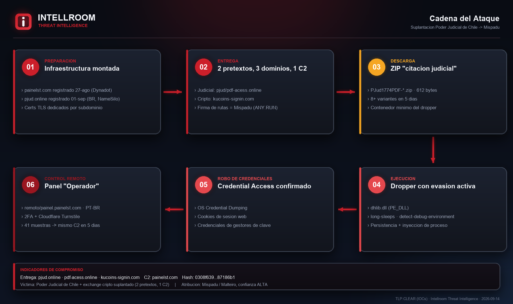
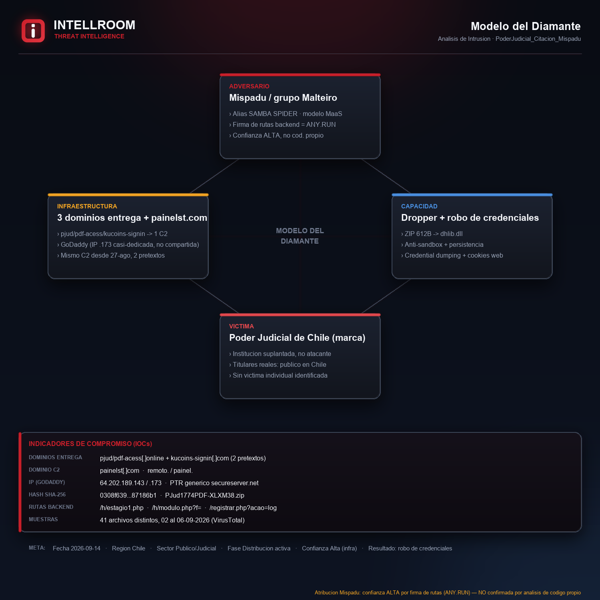

# Suplantación del Poder Judicial de Chile → distribución de Mispadu

**Fecha:** 2026-09-14 · **TLP:CLEAR** · Intellroom CTI
**Contexto:** el CSIRT Nacional de Chile alertó sobre una campaña de fraude contra el Poder
Judicial la semana del 2026-09-08 (junto a Itaú, MetLife, Líder, Outlook y GTD Telsur), sin
publicar IOC propios para esta marca. Esta ficha los cierra.

La víctima descarga un ZIP nombrado como si fuera el documento de una causa judicial real
(`PJud1774PDF-XXXXXX.zip`). No es un simple robo de credenciales por formulario: el ZIP
dropea **malware** (`dhlib.dll`) con evasión activa de sandbox, persistencia y capacidades de
robo de credenciales, que reporta a un panel de control remoto en portugués brasileño.

> ⚠️ Análisis por **OSINT pasivo + lectura de reportes de sandbox públicos** (VirusTotal).
> **Ningún archivo se ejecutó en equipos de Intellroom.**

---

## 🔴 Actualización 2026-09-14 (mismo día, horas después): un tercer dominio, mismo C2

`pdf-acess.online` (registrado 10-09-2026) tiene el **mismo WHOIS exacto** que `pjud.online`
— mismo registrante, correo desechable y teléfono — y **no tiene certificado TLS propio**: el
servidor le responde con el certificado de `painel.painelst.com`. Es el **mismo servidor
físico de C2**, con un tercer nombre de fachada (typosquat de "pdf-access", mismo gancho que
"PJud1774PDF"). No es una campaña nueva — esta ficha se amplía en vez de fragmentarse.
Detalle completo en la sección 11 de [`03_evidencia_tecnica.txt`](03_evidencia_tecnica.txt).

## 🔴 Segunda actualización 2026-09-14: reverse IP lookup — un cuarto dominio y otro pretexto

Buscamos qué más apunta a las dos IP del C2. **`64.202.189.143` es hosting compartido real**
— 29 dominios ajenos coalojados, sin relación con la campaña. **`64.202.189.173` no**: solo
2 dominios en total, y los dos son del atacante. El segundo es `kucoins-signin.com` — typosquat
del exchange de criptomonedas **KuCoin**, con el **mismo certificado TLS exacto** que
`painel.painelst.com`. El operador reparte al menos dos pretextos (Poder Judicial de Chile +
exchange cripto) desde el mismo servidor de control. Detalle completo en la sección 12 de
[`03_evidencia_tecnica.txt`](03_evidencia_tecnica.txt).

---

## El hallazgo que cambia la ficha: no es solo "suplantación al PJUD"

ANY.RUN publica esta consulta para rastrear campañas activas de **Mispadu**, el troyano
bancario latinoamericano operado por el grupo **Malteiro** (alias SAMBA SPIDER):

```
url:"/gerar/gerar.php" or url:"/registrar.php?dominio=" or
url:"/h/modulo.php?f=" or url:"/h/estagio?1.php" or
url:"/api/source-file.php?f=" or url:"/api/upload-source.php?"
```

Dos de esas rutas **coinciden literal** con lo que sirve `pjud.online`:

| Firma de ANY.RUN (Mispadu) | Observado en `pjud.online` |
|---|---|
| `/h/modulo.php?f=` | `/h/modulo.php?f=...&t=...` |
| `/h/estagio?1.php` | `/h/estagio1.php` |
| `/registrar.php?dominio=` | `/registrar.php?acao=log&status=...` (mismo endpoint base) |

**No es coincidencia de nombre: es el mismo patrón de endpoints de su infraestructura de
entrega**, ya asociado por un analista independiente a esta familia. Confianza **ALTA**, no
confirmada por análisis de código propio — ver limitaciones.

---

## Cadena del ataque



1. **Señuelo** (no observado) — inferido de una citación/notificación judicial falsa; "1774"
   en el nombre del archivo opera como número de causa falso.
2. **Entrega** — `pjud.online` (registrado 01-09-2026, registrante brasileño con correo
   desechable) sirve el kit por rutas en portugués: *estágio* (etapa), *acao*/*registrar…log*
   (acción/registro).
3. **Descarga** — ZIP de 612 bytes, `PJud1774PDF-*.zip` (8+ variantes verificadas).
4. **Ejecución** — dropea `dhlib.dll`, con evasión anti-sandbox confirmada por **dos**
   sandboxes independientes (CAPE Sandbox y Zenbox, vía VirusTotal): `long-sleeps`,
   `detect-debug-environment`, `checks-network-adapters`.
5. **Robo de credenciales** — confirmado en el árbol de comportamiento: OS Credential
   Dumping, robo de cookies de sesión web, credenciales de gestores de contraseñas.
6. **Control remoto** — el malware reporta a un panel **"Operador"** en `painelst.com`
   (`remoto.` y `painel.`), en portugués, con roles Operador/Dispositivo, 2FA y Cloudflare
   Turnstile como anti-bot.

## Modelo del Diamante



---

## No es un caso aislado — 41 muestras en 5 días

Según VirusTotal, **41 archivos distintos** se comunicaron con `remoto.painelst.com` entre el
2 y el 6 de septiembre de 2026: al menos 8 variantes del ZIP señuelo y múltiples copias de
`dhlib.dll` con distintas tasas de detección. Es volumen de campaña activa, no un envío
puntual.

El único hash que Intellroom verificó por completo:

```
SHA-256: 0308f63951e10230b46ec104fe3c0f3ec122c44761cf73653f127be9d87186b1
PJud1774PDF-XLXM38.zip · 612 bytes · 19/65 en VirusTotal
```

---

## Regla de oro: `pjud.cl` NO es un indicador

`pjud.cl` es el dominio **real** del Poder Judicial de Chile — la marca suplantada, la
víctima institucional. Se anota para que nadie lo confunda con `pjud.online` ni lo sume a
una blocklist por asociación.

**Tampoco se bloquean las IP directamente.** `64.202.189.143` y `64.202.189.173` (GoDaddy)
tienen PTR genérico (`*.secureserver.net`), patrón típico de hosting compartido —
no verificado como dedicado al atacante. La acción correcta es bloquear por **dominio**.

---

## Por qué el CSIRT alertó y esta ficha no repite lo mismo

El CSIRT publicó **seis alertas de campaña fraudulenta contra marcas chilenas el mismo
08-09-2026** (Itaú, MetLife, Líder, Outlook, GTD Telsur y Poder Judicial), sin IOC públicos
para esta última. El hilo común entre las seis no es un actor identificado: es el **método**
de distribución. Esta ficha completa esa alerta con infraestructura, comportamiento
confirmado por sandbox y atribución a una familia de malware conocida.

---

## Archivos

| Archivo | Contenido |
|---|---|
| [`iocs.txt`](iocs.txt) | Indicadores para bloqueo rápido, con acción por línea: `[BLOQUEAR]` · `[VIGILAR]` · `[REFERENCIA]` · `[DETECTAR]` · `[NO ES IOC]` |
| [`PoderJudicial_Citacion_Mispadu_14092026.txt`](PoderJudicial_Citacion_Mispadu_14092026.txt) | Ficha completa: resumen, cadena, línea de tiempo, **atribución**, "lo que NO es un IOC", MITRE ATT&CK, recomendaciones, valoración y limitaciones |
| [`03_evidencia_tecnica.txt`](03_evidencia_tecnica.txt) | Mediciones crudas y reproducibles: DNS, WHOIS, certificados TLS, urlscan.io, VirusTotal (dominio + archivo + sandbox), perfil de ANY.RUN |
| `01_flujo_ataque.png` · `02_modelo_diamante.png` | Diagramas de Intellroom |

**Todos los indicadores van defanged.** Al aplicarlos: reemplazar `[.]` → `.` y `hxxp` → `http`.

---

## MITRE ATT&CK (confirmadas por sandbox, IDs leídos directo del reporte)

| Técnica | Táctica | Uso en esta campaña |
|---|---|---|
| `T1055` Process Injection (×8) | Priv. Esc. / Evasion | El más frecuente en el reporte de sandbox |
| `T1082` System Information Discovery (×12) | Discovery | Fingerprinting agresivo, consistente con anti-VM |
| `T1027` Obfuscated Files or Information | Defense Evasion | `obfuscated` en tags de comportamiento |
| `T1547` Boot or Logon Autostart Execution | Persistence | `persistence` en tags de comportamiento |
| `T1003` OS Credential Dumping | Credential Access | Confirmado en árbol de comportamiento |
| `T1539` Steal Web Session Cookie | Credential Access | Confirmado en árbol de comportamiento |
| `T1555` Credentials from Password Stores | Credential Access | Confirmado en árbol de comportamiento |
| `T1497` Virtualization/Sandbox Evasion | Defense Evasion | *inferida* — `long-sleeps` + `detect-debug-environment` |
| `T1583.001` Acquire Infrastructure: Domains | Resource Development | *inferida* — `pjud.online` + `painelst.com` |
| `T1656` Impersonation | Resource Development | *inferida* — marca del Poder Judicial |

Lista completa (16 técnicas confirmadas + 7 inferidas de campaña) en la ficha principal,
sección 7.

---

*Intellroom — Cyber Threat Intelligence · [intellroom.com](https://intellroom.com)*
