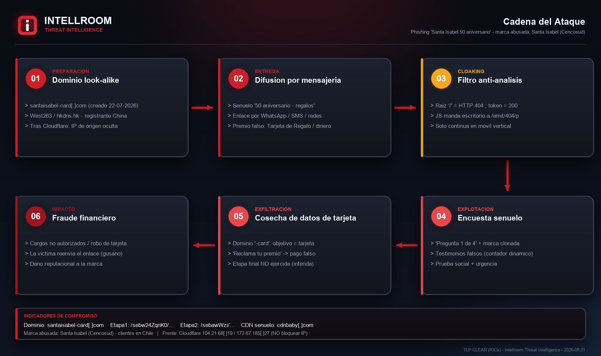
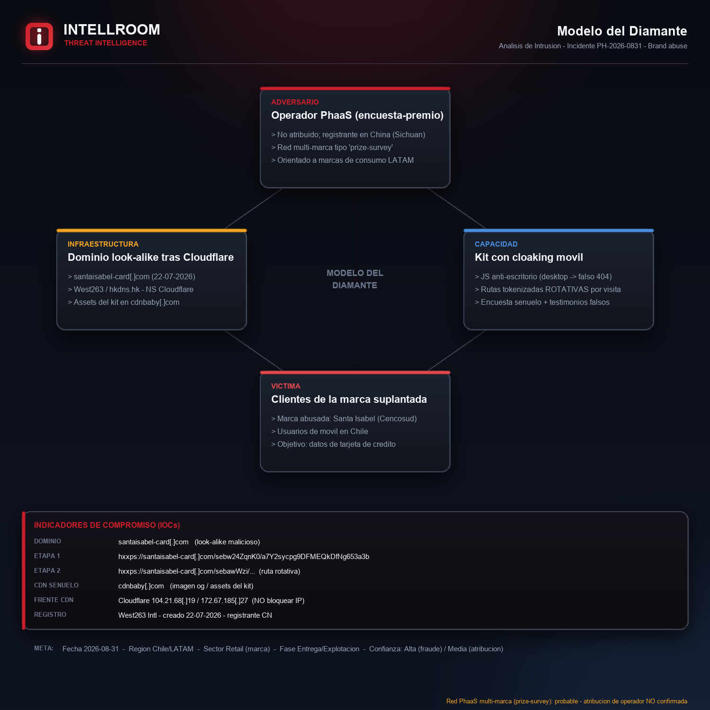
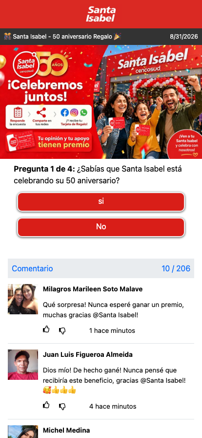

# Phishing "Santa Isabel — 50 aniversario" → robo de datos de tarjeta

**Dominio:** `santaisabel-card[.]com` · **Fecha:** 2026-08-31 · **TLP:CLEAR** · Intellroom CTI

Sitio *look-alike* que suplanta a **Santa Isabel (Cencosud, Chile)** con un señuelo de
"50 aniversario" que promete una *Tarjeta de Regalo* a cambio de responder una encuesta.
El nombre del dominio anuncia el objetivo: **`-card`** = datos de tarjeta de crédito.

Dos rasgos lo definen:

1. **Cloaking móvil** — la raíz devuelve **HTTP 404** y el contenido se sirve **solo a
   navegadores móviles**; a escritorio le entrega un 404 falso. Un analista o sandbox de
   escritorio "no ve nada".
2. **Infraestructura desechable y multi-marca** — dominio nuevo (22-07-2026), registrador
   chino de bajo costo, tras Cloudflare, assets en `cdnbaby[.]com`, y **rutas que rotan en
   cada visita**. Firma de una red PhaaS de "encuesta-premio".

> ⚠️ Análisis por **OSINT pasivo + render aislado**. **No se envió ningún dato al sitio.**
> La captura de tarjeta se **infiere** del dominio y del patrón; no se ejerció la etapa final.

---

## Cadena del ataque



## Modelo del Diamante



## Captura de la página señuelo (render móvil aislado, sin interacción)



*Marca de Santa Isabel clonada, encuesta falsa "Pregunta 1 de 4" y comentarios/"ganadores"
fabricados con fotos de stock. El contador de comentarios cambia entre visitas (10/185 → 10/206):
prueba social generada dinámicamente.*

---

## Archivos

| Archivo | Contenido |
|---|---|
| [`SantaIsabel_50Aniversario_31082026.txt`](SantaIsabel_50Aniversario_31082026.txt) | Ficha completa: resumen, línea de tiempo, **"LO QUE NO ES UN IOC"**, indicadores, TTP, MITRE ATT&CK, recomendaciones, valoración |
| [`iocs.txt`](iocs.txt) | Solo indicadores, con **acción por línea** (`BLOQUEAR` / `VIGILAR` / `NO ES IOC` / `DETECTAR`) |
| [`05_evidencia_tecnica.txt`](05_evidencia_tecnica.txt) | WHOIS, DNS, prueba reproducible del cloaking (404 vs 200), análisis del JS |
| [`04_gateway_cloaking.html`](04_gateway_cloaking.html) | HTML de la etapa 1 capturado (contiene el script de cloaking) |
| `01_flujo_ataque.png` · `02_modelo_diamante.png` · `03_captura_pagina_movil.png` | Diagramas branded + evidencia |

---

## Bloqueo rápido

```
BLOQUEAR (por DOMINIO):   santaisabel-card[.]com
VIGILAR:                  cdnbaby[.]com
NO BLOQUEAR:              104.21.68.19 / 172.67.185.27 (Cloudflare, compartido)
                          santaisabel.cl / cencosud.com (marca suplantada = víctima)
```

- **Bloquear por dominio**, nunca por la IP de Cloudflare ni por una ruta exacta (rotan).
- **Takedown en paralelo:** Cloudflare abuse · `abuse@hkdns.hk` · CSIRT/ANCI Chile
  (alerta `8FFR22-01132-01`) · brand-protection de Cencosud · PhishTank/URLhaus/APWG.

---

**Santa Isabel / Cencosud es la marca suplantada (la parte perjudicada), no el atacante.**
No hay ningún cliente de Intellroom involucrado en esta campaña.
