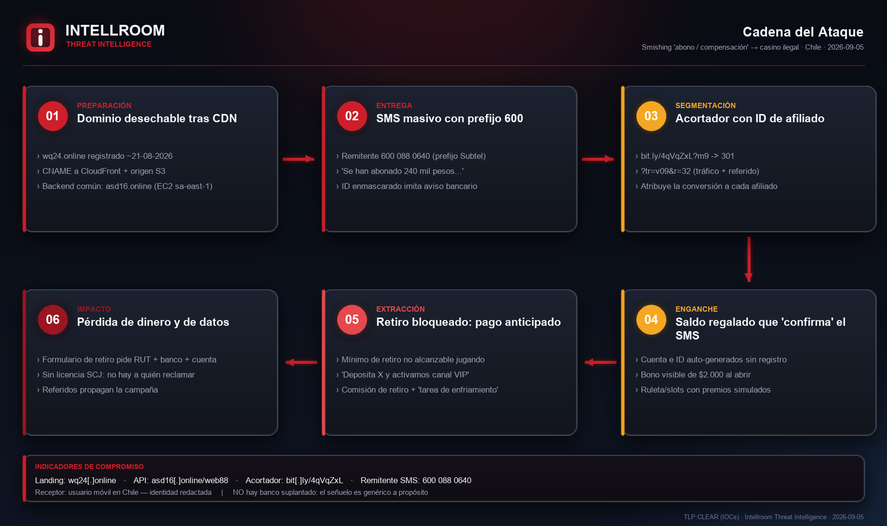
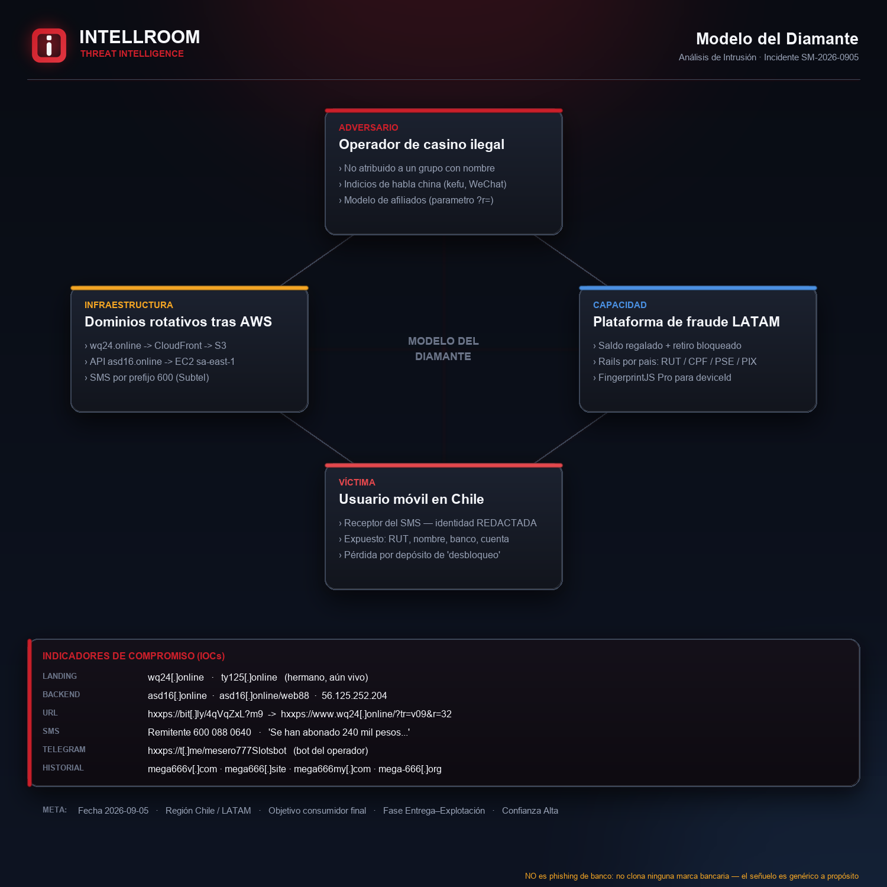
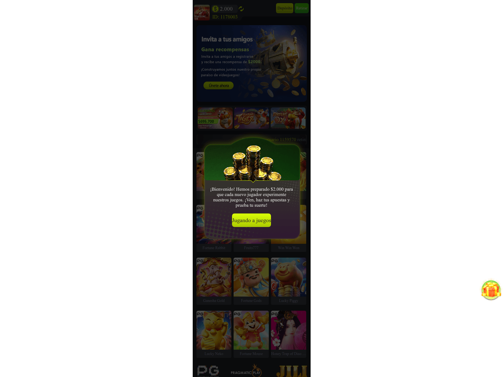

# Smishing "abono / compensación" → casino en línea sin licencia (Chile)

**Landing:** `wq24[.]online` · **Backend:** `asd16[.]online` · **Fecha:** 2026-09-05 · **TLP:CLEAR** · Intellroom CTI

Un SMS masivo dice que *"se han abonado 240 mil pesos a su cuenta como compensación"*
y ofrece un enlace acortado para "verificar el saldo". **No nombra ningún banco, no
lleva logo y no clona ningún sitio bancario.**

Esa ausencia no es descuido: es el diseño. El señuelo es genérico para que cada
receptor lo asocie con *su* propio banco, y de paso evita clonar una marca y esquivar
los filtros que buscan dominios parecidos a los de un banco.

El enlace no lleva a un banco falso. Lleva a un **casino en línea sin licencia** que
regala $2.000 al abrirlo —el "abono" que el SMS prometía— y después **bloquea el
retiro hasta que la víctima deposite dinero real**. Para cobrar, pide nombre, **RUT**,
banco y número de cuenta.

Dos daños en la misma cadena: **pérdida económica** por fraude de pago anticipado y
**entrega de datos personales y bancarios** a un tercero no identificado.

> ⚠️ Análisis por **OSINT pasivo + lectura estática del código servido**.
> **No se creó cuenta, no se ingresó ningún dato y no se depositó dinero.**

---

## Cadena del ataque



## Modelo del Diamante



## Captura del destino real



*Lo que ve quien abre el enlace: no es un banco. Cuenta con ID auto-generado, saldo
regalado de **$2.000** ("Hemos preparado $2.000 para que cada nuevo jugador experimente
nuestros juegos") y ticker de "ganadores" fabricado. El saldo regalado es lo que hace
que la promesa del SMS parezca cumplirse.*
*Fuente de la imagen: escaneo público de urlscan.io (2026-09-04), no una visita propia.*

---

## Lo que hace única a esta campaña

| | |
|---|---|
| **No suplanta a ningún banco** | Verificado. Ni el SMS ni el sitio clonan una marca bancaria. Etiquetarla como "phishing bancario" lleva a aplicar el control equivocado. |
| **Abusa del prefijo 600** | La Res. Ex. 1319 de Subtel (05-06-2026) reserva el 600 a comunicaciones **solicitadas**, por servicios ya contratados. Un SMS masivo no solicitado desde un 600 es, además del fraude, un incumplimiento normativo → reportable a Subtel. |
| **Paga por afiliado** | `?tr=v09&r=32` — tráfico y referido. Se observaron varios enlaces y varios afiliados sobre la misma infraestructura. |
| **Rota dominios desde 2024** | De `mega666*.com` a dominios desechables de 2 letras + dígitos en `.online` tras CloudFront. La marca quedó **dentro** de la página, donde las blocklists no la ven. |
| **Una plataforma, cuatro países** | El mismo bundle trae RUT (Chile), CPF/PIX (Brasil), PSE/NEQUI (Colombia) y BCP/BBVA/Interbank/Scotiabank (Perú). |
| **Ya se documentó en Colombia** | Julio 2026: *"¡Se han abonado 222.000 pesos colombianos a su cuenta!"* → `yu76[.]online`. Misma plantilla, moneda cambiada. |

---

## Archivos

| Archivo | Contenido |
|---|---|
| [`Smishing_Abono_Compensacion_CL_05092026.txt`](Smishing_Abono_Compensacion_CL_05092026.txt) | Ficha completa: resumen, el mensaje verbatim, hallazgo del prefijo 600, mecánica del fraude, historial de dominios, **"LO QUE NO ES UN IOC"**, indicadores, MITRE ATT&CK, recomendaciones, valoración y límites |
| [`iocs.txt`](iocs.txt) | Solo indicadores, con **acción por línea** (`BLOQUEAR` / `VIGILAR` / `NO ES IOC` / `DETECTAR`) |
| [`04_evidencia_tecnica.txt`](04_evidencia_tecnica.txt) | DNS, TLS, cabeceras HTTP, prueba de no-cloaking, análisis del bundle JS con citas literales, historial de escaneos |
| `01_flujo_ataque.png` · `02_modelo_diamante.png` · `03_captura_landing.png` | Diagramas branded + evidencia visual |

---

## Bloqueo rápido

```
BLOQUEAR (por DOMINIO):  wq24[.]online   ty125[.]online   asd16[.]online
                         mega666v[.]com  mega666[.]site
                         mega666my[.]com mega-666[.]org  yu76[.]online

BLOQUEAR (URL exacta):   bit[.]ly/4qVqZxL     bit[.]ly/46CnTFs

VIGILAR:                 56.125.252.204  (EC2, IP reasignable)
                         ns1/ns2.dyna-ns[.]net  (pivote a dominios hermanos)
                         6000880640  (remitente SMS → reportar a Subtel)

NO BLOQUEAR:             bit[.]ly como servicio  ·  108.158.104.0/24 y
                         13.227.123.0/24 (CloudFront, compartidas)  ·  fpjs[.]dev
                         PG Soft / Pragmatic Play / JILI (marcas abusadas)
                         Scotiabank / BCP / BBVA / Interbank (bancos = víctimas)
```

**Los dominios de landing se rotan cada 1–2 semanas.** No construir la defensa solo
sobre la lista: cargar también la regla de patrón (`iocs.txt` → sección `DETECTAR`).
`asd16[.]online` es el backend compartido y por eso el indicador de mayor vida útil.

---

## Reportes que corresponden

1. **Subtel** — abuso del prefijo 600 (Res. Ex. 1319/2026). Es la vía más rápida para cortar el canal de entrega.
2. **Bitly** — abuse report de los enlaces; matarlos rompe la cadena aunque el dominio siga vivo.
3. **AWS Abuse** — frente CloudFront/S3 y el EC2 del backend.
4. **CSIRT Nacional / ANCI** — no hay alerta pública previa de esta cadena para Chile.
5. **SCJ** (Superintendencia de Casinos de Juego) — juego en línea sin licencia dirigido a residentes en Chile.

---

## Si recibiste este SMS

- **No abras el enlace.** Si ya lo abriste y solo miraste: no hay compromiso del teléfono — esta cadena no descarga ni ejecuta nada en el dispositivo.
- **Si ingresaste RUT, banco o número de cuenta:** avisa a tu banco por su canal oficial y vigila movimientos.
- **Si depositaste dinero: no deposites más.** Ninguna cifra adicional destraba el retiro — esa *es* la mecánica. Denuncia a PDI/Fiscalía.
- **Verifica cualquier "abono"** entrando a la app de tu banco a mano, nunca por un enlace recibido.

---

**El receptor del SMS es la parte perjudicada y su identidad no se publica.**
Las marcas de juegos y los bancos que aparecen en el sitio son **marcas abusadas, no el atacante**.
Ninguna organización cliente de Intellroom está involucrada en esta campaña.
