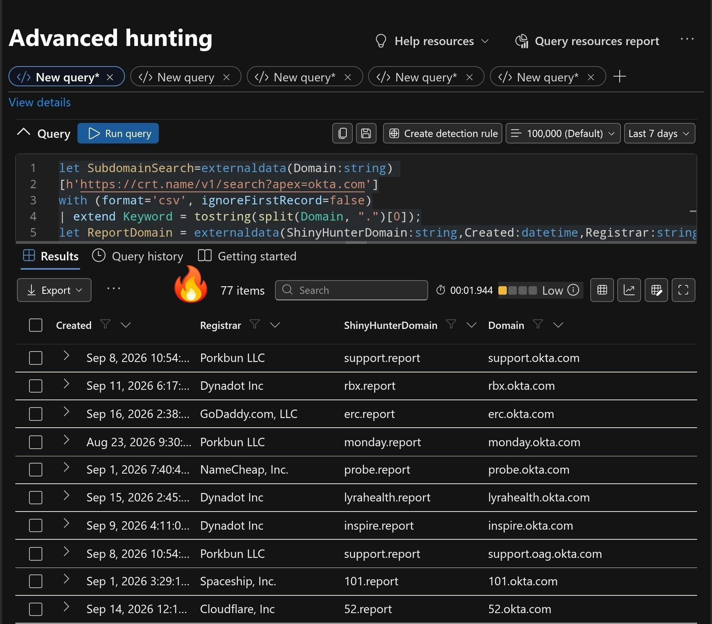

# "Potencial campaña ShinyHunters" — dominios .report que copian tenants Okta reales

**TLP:CLEAR** · **Fecha del hallazgo:** 17-09-2026 · **Verificado y ampliado por Intellroom:** 17-09-2026

Un investigador independiente ([@0x534c](https://x.com/0x534c), Steven Lim, cuenta verificada, [post original](https://x.com/0x534c/status/2100554716820156781)) publicó una correlación por KQL (Microsoft Defender Advanced Hunting) entre subdominios de `okta.com` y dominios `.report` recién registrados, declarando **77 coincidencias** donde el identificador es idéntico en ambos lados (ej. `lyrahealth.report` junto a `lyrahealth.okta.com`). Su propio título usa la palabra **"Potential"** — no es una atribución confirmada.

Intellroom recibió por separado una lista de **317 dominios `.report`** y la cruzó de dos formas independientes antes de publicar esto:

1. **Confirmó que es la misma fuente subyacente** que usó Steven Lim — 9 dominios visibles en su captura calzan exacto contra el CSV recibido, ajustando un offset horario constante de +8h.
2. **Reprodujo la correlación de forma propia**, sin depender de la fuente que declara su query (`crt.name`, que no es el agregador público estándar `crt.sh` y no se pudo verificar que exista): resolvió por DNS cada uno de los 317 identificadores como `<identificador>.okta.com`.

## El hallazgo metodológico

El primer intento (¿resuelve `<id>.okta.com`?) dio **317 de 317** — inútil, porque `*.okta.com` tiene un front-door genérico que responde igual para *cualquier* texto inventado. La señal que sí discrimina: un tenant realmente aprovisionado enruta a una **celda específica** (`ok1-crtrs.tng.okta.com` … `ok14-crtrs.tng.okta.com`), mientras que un identificador inventado cae en el balanceador genérico compartido. Aplicando ese criterio: **33 de 317** dominios `.report` coinciden con un tenant Okta real y activo.

## Los 33 confirmados

Registrados de forma continua entre el 2026-08-20 y el 2026-09-16 (no una ráfaga de un día), a través de **13 registradores distintos** (Dynadot 8, NameCheap 7, Cloudflare 6, GoDaddy 3, y 6 más con 1 cada uno) — a diferencia de la campaña `.claims` de ShinyHunters confirmada en agosto (61 dominios, 48 marcas, **un solo** registrador), que se cita como precedente de modus operandi, no como la misma infraestructura.

Entre los 33, varios identificadores coinciden con marcas reales reconocibles: `hcahealthcare` (HCA Healthcare), `lyrahealth` (Lyra Health), `expeditors` (Expeditors International), `discounttire-retail` (Discount Tire), `unum` (Unum), `ahrefs` (Ahrefs), `offerup` (OfferUp), y posiblemente `rbx` (Roblox) y `monday` (monday.com) — salud, seguros y logística predominan entre las marcas reconocibles.

**Hallazgo de prioridad:** `gen.report` respondió `200` con redirección a `/login/?next=/` en el chequeo HTTP pasivo (solo cabeceras, sin descargar contenido ni completar ningún formulario) — el único de los 33 con una señal clara de contenido activo tipo formulario de login.

**No se atribuye a ShinyHunters con confianza.** El patrón (dominio señuelo que copia el tenant Okta real de una empresa, para vishing de soporte/IT) es indistinguible de las TTP recientes tanto de ShinyHunters como de Scattered Spider — dos grupos cuyo modus operandi se ha ido fusionando durante 2026 según múltiples reportes de terceros.

## Evidencia

**Captura del post original** (@0x534c, 17-09-2026) — consulta KQL en Microsoft Defender Advanced Hunting y sus 10 primeras filas de resultados:

## Documentos

- **[`ShinyHunters_Okta_Report_Domains_17092026.txt`](ShinyHunters_Okta_Report_Domains_17092026.txt)** — ficha completa: resumen, línea de tiempo, el hallazgo metodológico explicado, los 33 dominios confirmados con su celda Okta, verificación HTTP pasiva, MITRE ATT&CK, acciones recomendadas y todo lo que **no** se pudo verificar.
- **[`iocs.txt`](iocs.txt)** — solo indicadores, con acción por línea (`[BLOQUEAR]` / `[VIGILAR]` / `[NO ES IOC]` / `[DETECTAR]`), defanged.
- **[`dominios_report_317_20260917.csv`](dominios_report_317_20260917.csv)** — la lista cruda de 317 dominios `.report` recibida (domain/created/registrar), para que cualquiera pueda reproducir el cruce con su propia fuente de subdominios Okta.

## Lo que no se publica / no se confirma

- Los otros **284 dominios** `.report` de la lista original **no se incluyen como IOC** — la mayoría son palabras genéricas sin relación demostrable con Okta ni con ninguna marca (ruido de registro masivo/SEO del mismo TLD).
- `52.report` / `52.okta.com`: Steven Lim lo muestra como una de sus 77 coincidencias; verificado hoy por Intellroom, `52.okta.com` enruta al front-door genérico, no a una celda específica. Se declara la discrepancia, no se resuelve.
- El contenido detrás de `gen.report` (o de cualquier otro dominio) — el chequeo fue solo de cabeceras HTTP, ningún formulario fue completado.
- Los 68 dominios restantes de los 77 que declara el post original — solo 10 filas eran visibles en la captura obtenida.

---
*Intellroom Threat Intelligence — análisis pasivo: verificación DNS pública + una petición HTTP HEAD estándar por dominio. Ningún dominio de esta lista fue registrado, comprado ni contactado por ningún otro medio.*
