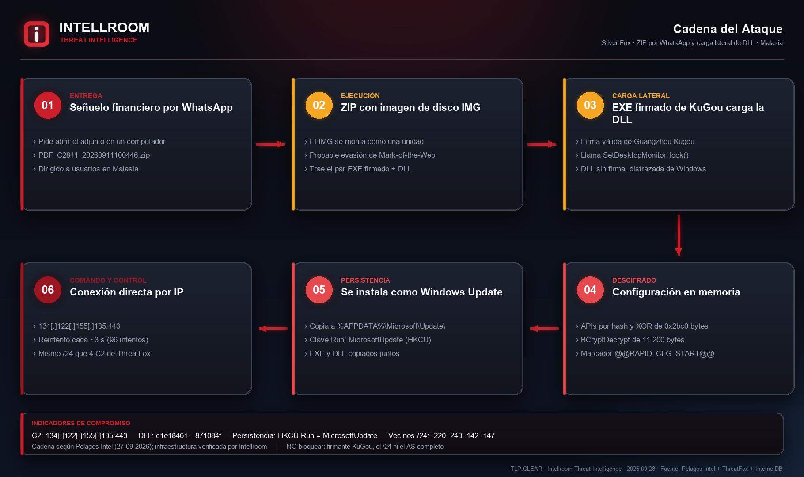
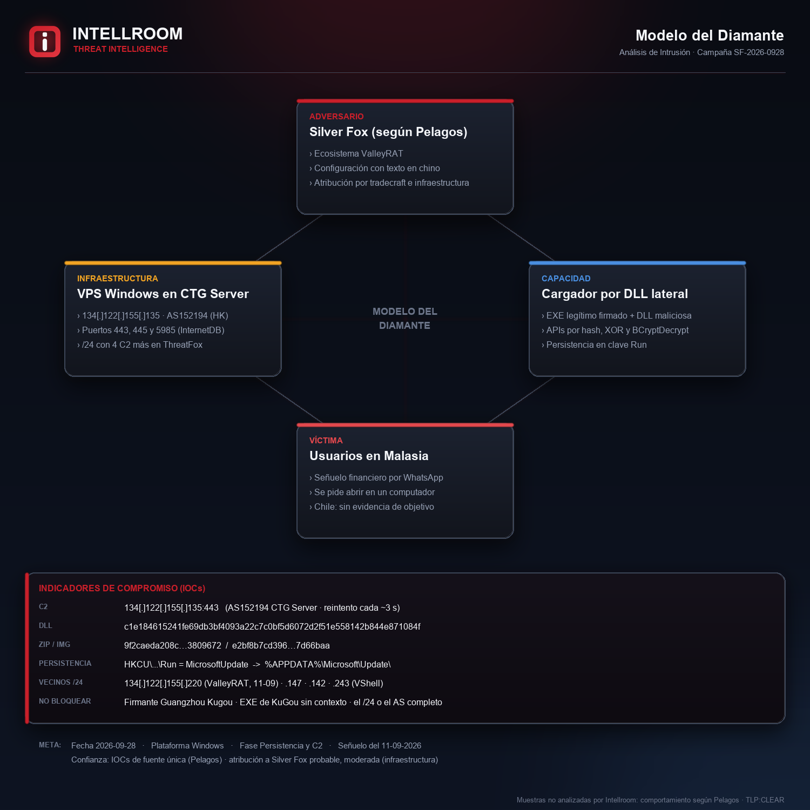
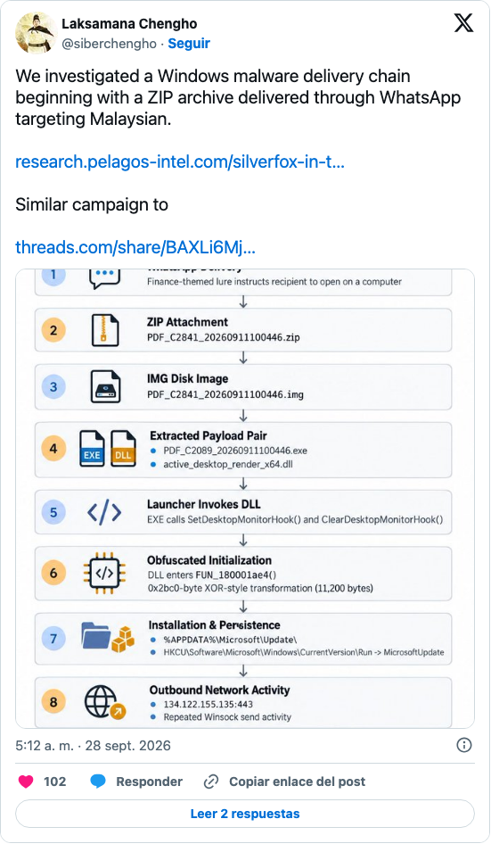

# Silver Fox: ZIP por WhatsApp, imagen de disco y carga lateral de DLL contra Malasia

**Actor:** Silver Fox, según Pelagos Intel · **Objetivo:** usuarios en Malasia · **Entrega:** WhatsApp (MITRE ATT&CK T1566.003) · **Técnica central:** carga lateral de DLL con un ejecutable firmado de KuGou · **TLP:CLEAR**
**Fuente primaria:** [Pelagos Intel, «SilverFox in the Desktop»](https://research.pelagos-intel.com/silverfox-in-the-desktop) (27-09-2026), difundido por [@siberchengho](https://x.com/siberchengho/status/2104484299412287540) en X · **Contrastado y ampliado por Intellroom:** 28-09-2026

Una persona en Malasia recibe por WhatsApp un mensaje con tema financiero que le pide **abrir el adjunto en un computador**. El adjunto es un ZIP con una imagen de disco IMG adentro, y dentro del IMG viene un ejecutable con **firma válida de Guangzhou Kugou Technology** junto a una DLL sin firma que se hace pasar por un componente de Windows. El ejecutable firmado carga la DLL, que descifra su configuración en memoria, se instala en `%APPDATA%\Microsoft\Update\`, se registra en la clave Run como `MicrosoftUpdate` y se conecta cada tres segundos a una IP fija.

El análisis del malware es de Pelagos; Intellroom no tuvo las muestras. Lo que agrega esta carpeta es la **infraestructura**: el C2 no está solo.

## Lo que esta ficha agrega a lo ya publicado

- **El mismo /24 del C2 aloja otros cuatro C2 reportados en ThreatFox:** tres de **ValleyRAT**, la herramienta que se asocia a Silver Fox (dos de sus muestras están etiquetadas SilverFox en MalwareBazaar), y uno de VShell. Esto corrobora la atribución con una fuente distinta a Pelagos.
- **Coincidencia de fecha:** el C2 vecino `134[.]122[.]155[.]220` se reportó como ValleyRAT el **11-09-2026**, la misma fecha que lleva el nombre del ZIP señuelo (`PDF_C2841_20260911100446.zip`). Es consistente, no es prueba.
- **Perfil del C2:** AS152194, CTG Server Limited (Hong Kong), con los puertos 443, 445 (SMB) y 5985 (WinRM) abiertos según InternetDB. El vecino `.147`, C2 de ValleyRAT en junio, tiene exactamente el mismo perfil.
- **Los indicadores dependen de una sola fuente:** ninguno de los cuatro hashes está en MalwareBazaar y la IP del C2 no está en ThreatFox.
- **Una inconsistencia en la fuente:** el ZIP que llegó por WhatsApp es el **C2841**, pero el ejecutable analizado se llama **C2089**. Pelagos no lo explica.
- **Corrección de ATT&CK:** la entrega por WhatsApp es **T1566.003** (vía servicio), no T1566.001 (adjunto de correo).

## Indicadores (resumen)

| Tipo | Valor | Acción |
|---|---|---|
| IP (C2) | `134[.]122[.]155[.]135` · AS152194 | Bloquear (según Pelagos) |
| Hashes | ZIP, IMG y DLL, ver `iocs.txt` | Bloquear |
| IP (mismo /24, ThreatFox) | `.220`, `.243`, `.142`, `.147` | Bloquear las IP puntuales |
| EXE firmado por KuGou | `f712c2a8…e4830d` | **Vigilar:** es un binario legítimo usado de cargador |
| Persistencia | `HKCU\…\Run` = `MicrosoftUpdate` → `%APPDATA%\Microsoft\Update\` | Detectar |
| Firmante, /24 y AS completos | Guangzhou Kugou · 134.122.155.0/24 · AS152194 | **No bloquear** |

## Evidencia

| | |
|---|---|
|  |  |
|  |  |

*Captura 03: post de [@siberchengho](https://x.com/siberchengho/status/2104484299412287540) en X (28-09-2026), tomada del embed oficial. Captura 04: encabezado del artículo de Pelagos Intel (27-09-2026). Ambas reproducidas como fuente, con su crédito.*

## Documentos

- **[`SilverFox_WhatsApp_Malasia_28092026.txt`](SilverFox_WhatsApp_Malasia_28092026.txt)**: ficha completa. Qué agrega a Pelagos, línea de tiempo, indicadores, qué **no** es un IOC, MITRE ATT&CK, relevancia para Chile, evaluación de la fuente y todo lo que no se pudo verificar.
- **[`iocs.txt`](iocs.txt)**: solo indicadores, con acción por línea, defanged.
- **[`evidencia_fuente_y_hashes_28092026.txt`](evidencia_fuente_y_hashes_28092026.txt)**: cadena de custodia de la fuente (SHA-256 del artículo descargado), dónde aparece cada indicador y la búsqueda de los hashes en MalwareBazaar.
- **[`evidencia_infraestructura_c2_28092026.txt`](evidencia_infraestructura_c2_28092026.txt)**: RDAP, ASN, InternetDB y urlscan del C2 y de sus vecinos, con hora.
- **[`evidencia_threatfox_vecinos_28092026.txt`](evidencia_threatfox_vecinos_28092026.txt)**: la respuesta de ThreatFox para el /24 y las muestras de MalwareBazaar asociadas.
- Sumas de verificación en **[`evidencia.sha256`](evidencia.sha256)**.

## Lo que no se pudo verificar ni se publica

- **El comportamiento del malware y los hashes:** son de Pelagos. Intellroom no tuvo las muestras ni se conectó al C2.
- **Que el ZIP C2841 y el EXE C2089 sean de la misma entrega.**
- **Que el certificado de KuGou esté robado:** no hay datos; lo más probable es que el ejecutable sea un componente real de KuGou.
- **Víctimas:** una persona particular en Malasia contó en Threads que recibió un archivo similar; su identidad no se publica.
- **No hay evidencia de que la campaña apunte a Chile.** Lo que se traslada es la técnica: WhatsApp, adjunto para abrir en el computador y un programa firmado que carga una DLL.

---
*Intellroom Threat Intelligence: Pelagos Intel como fuente primaria; RDAP de ARIN y APNIC, Team Cymru, InternetDB de Shodan, urlscan.io, ThreatFox y MalwareBazaar de abuse.ch, y la matriz de MITRE ATT&CK. Sin conexiones al C2.*
