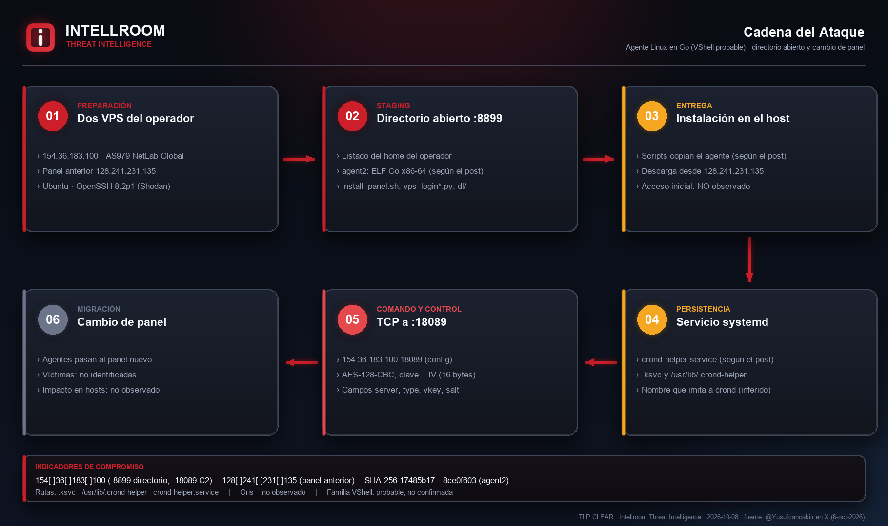
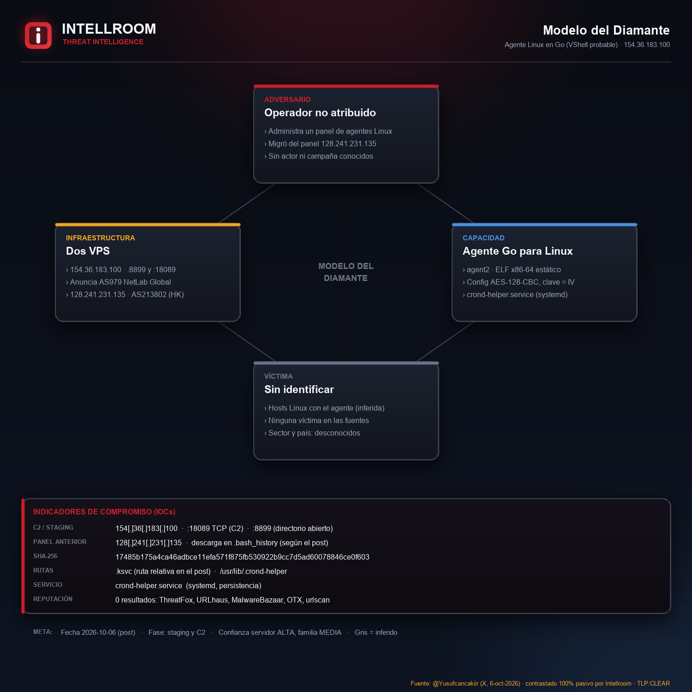
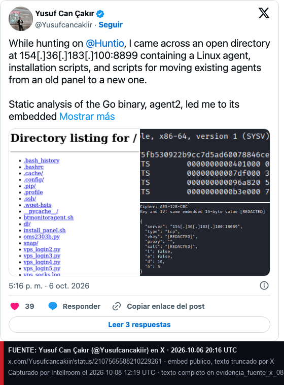
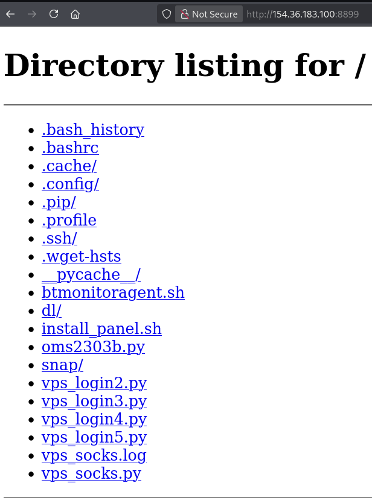
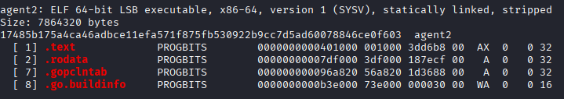
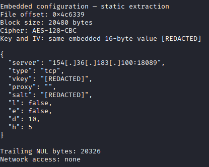

# Agente Linux en Go (VShell probable) en un directorio abierto, con migración de panel

**C2 y staging:** `154[.]36[.]183[.]100` (TCP `18089` C2, `8899` directorio abierto) · **Panel anterior:** `128[.]241[.]231[.]135` · **TLP:CLEAR**
**Fuente:** [Yusuf Can Çakır (@Yusufcancakiir) en X](https://x.com/Yusufcancakiir/status/2107565588210229261), 06-10-2026 · **Contrastado por Intellroom:** 08-10-2026, solo fuentes pasivas

Cazando en Hunt.io, el autor encontró un **directorio abierto en el puerto 8899** de un VPS con un **agente para Linux escrito en Go** (`agent2`), scripts de instalación y **scripts para mover agentes ya instalados desde un panel viejo a uno nuevo**. Con análisis estático llegó a la configuración embebida: **AES-128-CBC con la misma clave de 16 bytes como clave y como IV**. Descifrada, el agente se conecta por **TCP a `154[.]36[.]183[.]100:18089`**, la misma dirección del panel nuevo en los scripts de migración.

Los scripts instalan el agente en `.ksvc` y `/usr/lib/.crond-helper` y lo dejan persistente con la unidad systemd **`crond-helper.service`**. La IP del **panel anterior**, `128[.]241[.]231[.]135`, aparece en un comando de descarga del `.bash_history`, lo que une el servidor expuesto con la infraestructura previa.

El autor **sospecha que es VShell** por referencias en los scripts, pero **no confirmó la familia**. Intellroom tampoco: no hay muestra pública del binario. El campo `vkey` de la config es consistente con lo que NTT Security describió para VShell en TROOPERS26, sin probarlo. **No hay víctimas identificadas, ni actor, ni campaña conocida.**

**Qué agrega Intellroom:** titular y ruteo actual de las dos IP (Cogent anunciada por AS979 NetLab Global; NTT America anunciada por AS213802 TF Tianfeng, Hong Kong), sus servicios según Shodan, y la comprobación de que **ninguna fuente abierta las tenía** (ThreatFox, URLhaus, MalwareBazaar, OTX y urlscan: cero resultados). Shodan no lista hoy los puertos 8899 ni 18089: el directorio pudo cerrarse. Intellroom **no contactó el servidor ni descargó nada**.

## Correlación

VShell ya apareció en [SilverFox_WhatsApp_Malasia](../SilverFox_WhatsApp_Malasia) y [OpenDir_Operador_SurAsia](../OpenDir_Operador_SurAsia). Es una herramienta compartida por muchos actores: **misma familia no es mismo actor**, y no hay infraestructura en común. Mismo modo de hallazgo que [Erebus_C2_OpenDir](../Erebus_C2_OpenDir), [OpenDir_AD_Toolkit](../OpenDir_AD_Toolkit) y [Pfcloud_OpenDir_Staging](../Pfcloud_OpenDir_Staging).

## Evidencia

| | |
|---|---|
|  |  |

| Post original (crédito: @Yusufcancakiir) | Listado del directorio (imagen del autor) |
|---|---|
|  |  |

| ELF y hash de agent2 (imagen del autor) | Config descifrada (imagen del autor) |
|---|---|
|  |  |

## Documentos

- **[`VShell_OpenDir_Migracion_Panel_08102026.txt`](VShell_OpenDir_Migracion_Panel_08102026.txt)**: ficha completa con indicadores, qué **no** es un IOC, línea de tiempo, evaluación de la fuente (Admiralty B2), MITRE ATT&CK v19.2 verificado, ideas de caza y lo que no se pudo verificar.
- **[`iocs.txt`](iocs.txt)**: solo indicadores, con acción por línea, defanged.
- **[`evidencia_fuente_x_08102026.txt`](evidencia_fuente_x_08102026.txt)**, **[`evidencia_ip_rdap_08102026.txt`](evidencia_ip_rdap_08102026.txt)** y **[`evidencia_reputacion_08102026.txt`](evidencia_reputacion_08102026.txt)**: respuestas crudas con hora UTC. Sumas en **[`evidencia.sha256`](evidencia.sha256)**.

## Lo que no se pudo verificar

- **El binario:** hash, tamaño y config son del autor; no hay muestra pública.
- **La familia:** VShell probable, no confirmada.
- **Si el directorio sigue abierto:** el servidor no se contactó.
- **Víctimas, sector y país:** desconocidos. Sin señal de que toque Chile o LATAM.

---
*Intellroom Threat Intelligence: análisis 100% pasivo. Las ideas de detección son hipótesis: validar antes de desplegar. Bloqueos de IP con fecha de revisión 2026-11-08.*
