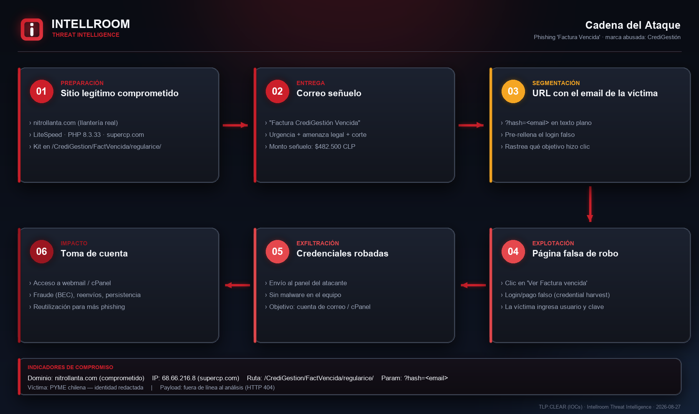
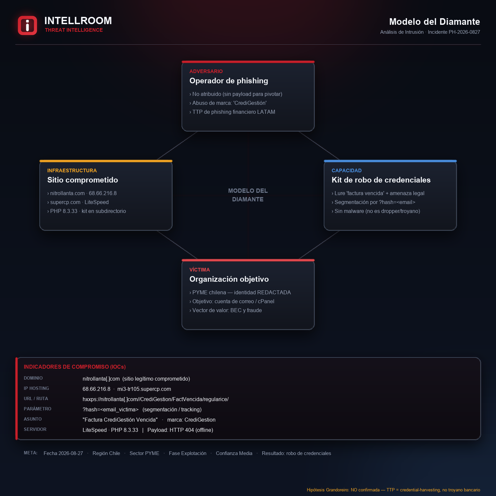

# Phishing "Factura Vencida" — Suplantación de CrediGestión

**Detección:** 2026-08-27 · **Región:** Chile · **Sector:** PYME
**Tipo:** Robo de credenciales (credential harvesting) · **Confianza:** Media
**TLP:CLEAR** (IOCs) · Análisis: Intellroom · Threat Intelligence

> Nota de privacidad: se **omite la identidad de la organización receptora** (víctima) por acuerdo.

## Resumen
Campaña de phishing con señuelo de **factura vencida** que suplanta a una supuesta entidad de cobranza
("CrediGestión"). El correo genera urgencia (vencimiento, corte de servicio, "problemas legales") y enlaza
a una página de **robo de credenciales** alojada en el sitio de un **negocio legítimo comprometido**
(`nitrollanta[.]com`, una llantería). La URL incluye el **email de la víctima en el parámetro `hash`**, lo
que pre-rellena el login falso y permite **segmentar/rastrear** al objetivo. **No entrega malware** — no es
un troyano bancario.

## Cadena del ataque

## Modelo del Diamante

## Atribución
La **hipótesis Grandoreiro NO se confirma**: Grandoreiro es un troyano bancario que entrega un ejecutable
y opera con overlays en el equipo. Aquí el vector es una **página web de captura de credenciales** con
segmentación por email — TTP de *credential harvesting*, no de dropper. Sin el payload (removido, HTTP 404)
no hay base para atribuir a una campaña nombrada.

## Recomendaciones
- Bloquear la **URL/ruta específica** (no el dominio completo: es un sitio legítimo comprometido).
- **2FA obligatorio** en webmail/cPanel + limitación de tasa y bloqueo de cuenta.
- Reportar la URL a Google Safe Browsing / PhishTank y notificar a `abuse@supercp.com` y al dueño del sitio.
- Ante clic/ingreso de credenciales: rotar contraseña, revisar **forwarders/filtros/reglas** (persistencia)
  y sesiones activas.

## Indicadores
Ver [`28082026.txt`](28082026.txt).
