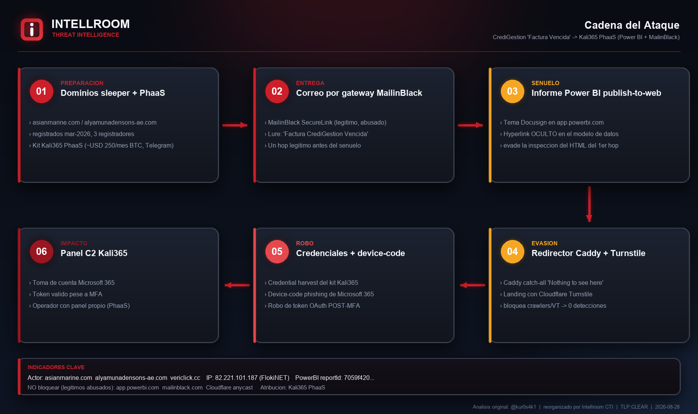
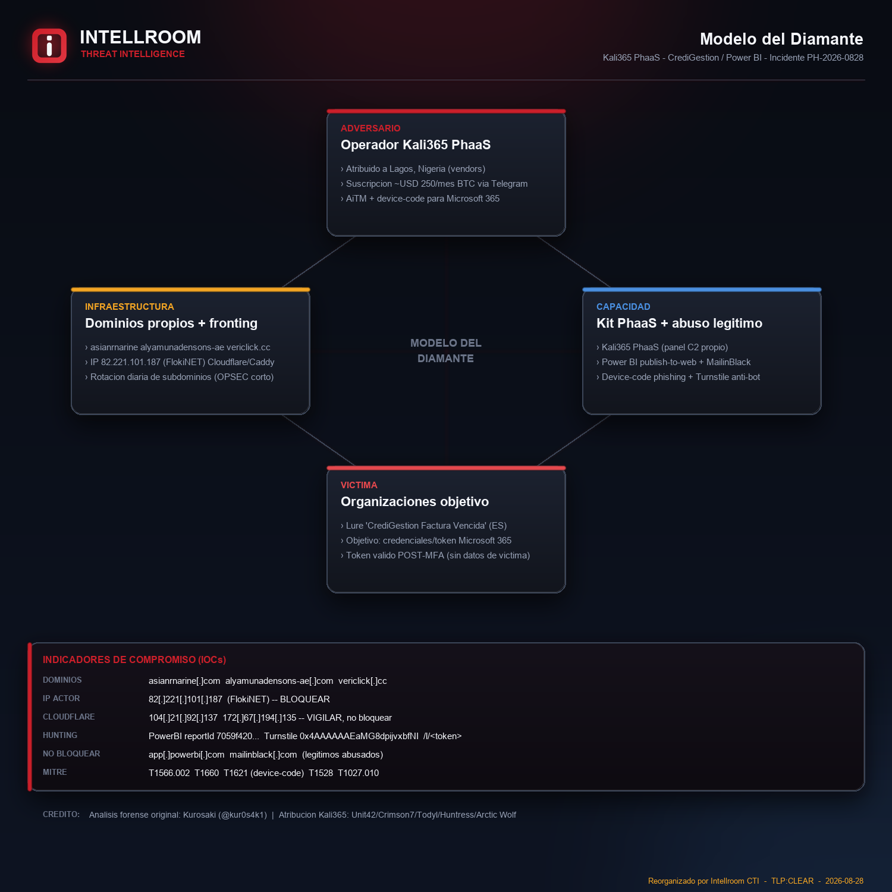

# CrediGestion "Factura Vencida" via Kali365 PhaaS (Power BI + MailinBlack)

**Fecha:** 2026-08-28 · **Región:** Chile (lure en español) · **TLP:CLEAR**
**Tipo:** Phishing de robo de credenciales + device-code (Microsoft 365) · **Actor:** Kali365 PhaaS
Análisis: Intellroom · Threat Intelligence

> **Crédito / fuente.** El análisis forense original —infraestructura, WHOIS, certificados,
> rotación de subdominios, fingerprint del panel y atribución— es de **Kurosaki
> ([@kur0s4k1](https://github.com/kur0s4k1))**:
> <https://github.com/kur0s4k1/IoC-PowerBI-Docusign-Phishing>.
> Esta ficha **reorganiza sus indicadores** en el formato Intellroom (bloqueo rápido con
> acción por línea + diagramas) para consumo directo del analista. La atribución a **Kali365
> PhaaS** proviene de Unit 42, Crimson7, Todyl, Huntress y Arctic Wolf. Sin datos de víctima.

## Resumen
El lure **"Factura CrediGestión Vencida"** entregado, en esta instancia, no por un sitio
comprometido sino por una **cadena PhaaS**: correo por gateway **MailinBlack** → informe
**Power BI publish-to-web** con señuelo Docusign (hyperlink oculto en el modelo de datos) →
redirector **Caddy** → landing anti-bot **Cloudflare Turnstile** → kit de **robo de
credenciales / device-code** de **Kali365**, con panel C2 propio.

## Relación con otra ficha del repo
Mismo lure que [`Phishing/CrediGestion_FacturaVencida`](../CrediGestion_FacturaVencida/),
**vector distinto**: aquella usaba un sitio legítimo comprometido (`nitrollanta[.]com`,
offline al observarse); esta usa la cadena Kali365/Power BI. **La correlación es el valor:**
el mismo señuelo se reutiliza sobre más de una infraestructura.

## Cadena del ataque

## Modelo del Diamante

## Regla de bloqueo (resumen — ver `iocs.txt`)
- **BLOQUEAR:** dominios del actor + la IP FlokiNET `82[.]221[.]101[.]187` (redirector dedicado).
- **VIGILAR, no bloquear:** IPs **Cloudflare anycast** (colateral masivo).
- **ALERTAR, no bloquear:** `app.powerbi.com` (publish-to-web desde correo externo), MailinBlack.
- **HUNT:** `reportId`/`tenant` de Power BI, sitekey de Turnstile, patrón `/l/<token>`, fingerprint del panel.

## Indicadores y MITRE
Ver [`iocs.txt`](iocs.txt) (bloqueo rápido) y [`28082026.txt`](28082026.txt) (ficha completa).
