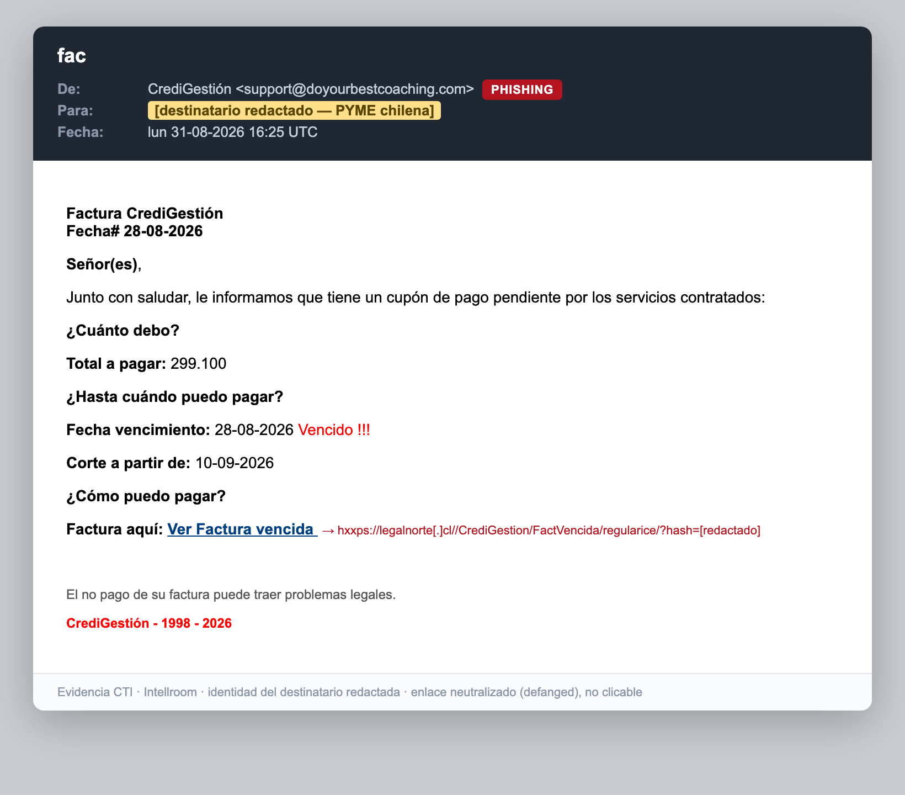
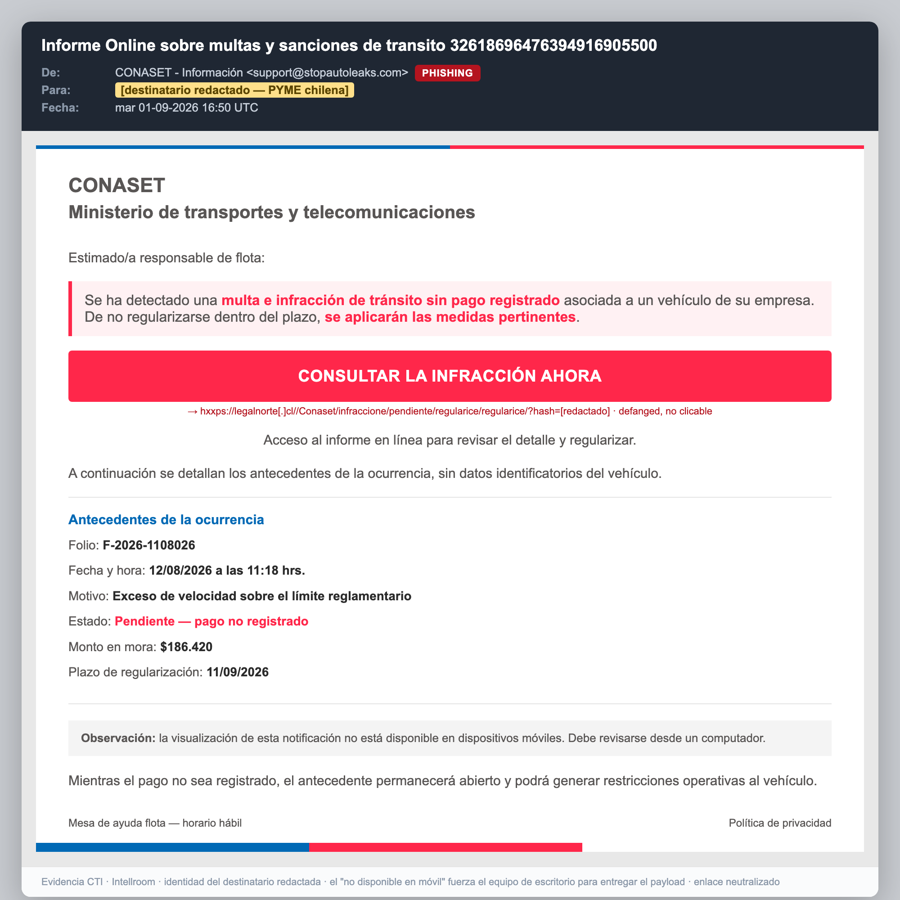
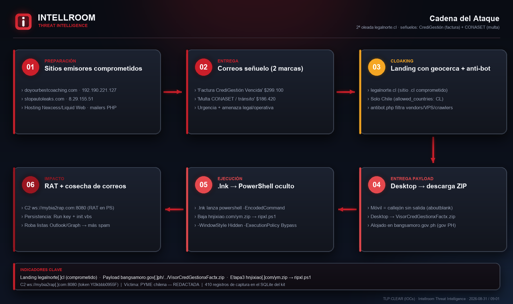
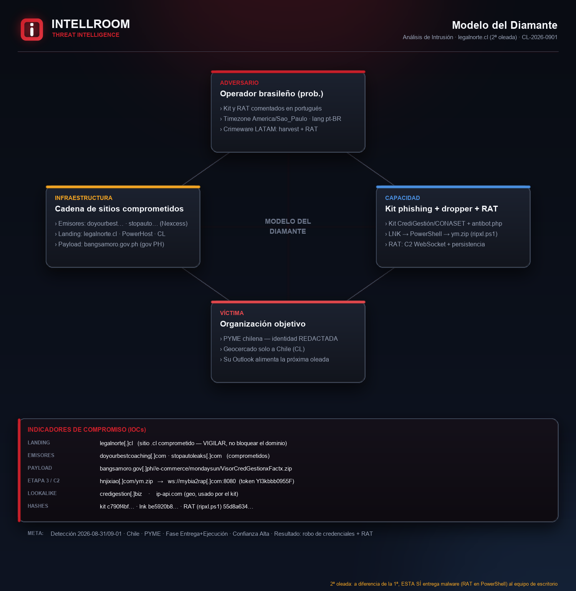
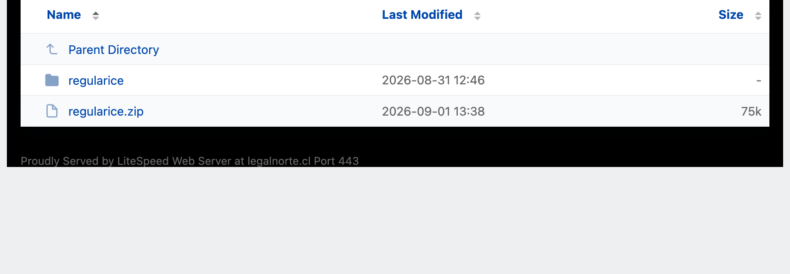

# Phishing 2ª oleada "legalnorte.cl" — CrediGestión (factura) + CONASET (multa)

**Detección:** 2026-08-31 / 2026-09-01 · **Región:** Chile · **Sector:** PYME
**Tipo:** Robo de credenciales **+ entrega de malware (RAT en PowerShell)** · **Confianza:** Alta
**TLP:CLEAR** (IOCs) · Análisis: Intellroom · Threat Intelligence

> Nota de privacidad: se **omite la identidad de la organización receptora** (víctima) — "PYME chilena, identidad redactada". No se extrajeron ni publican los datos de las víctimas del kit; solo su esquema y conteo.

## Resumen
Segunda oleada de la campaña **CrediGestión** (ver [`../CrediGestion_FacturaVencida`](../CrediGestion_FacturaVencida/)). El operador movió el landing de `nitrollanta[.]com` a un nuevo sitio chileno comprometido, **`legalnorte[.]cl`**, y sumó una **segunda marca suplantada: CONASET / Ministerio de Transportes** (falsa multa de tránsito). Los dos correos salen de **sitios legítimos distintos comprometidos** en hosting Nexcess/Liquid Web (mediante PHP inyectado) y enlazan al mismo kit.

🔴 **Cambio clave vs. la 1ª oleada: esta SÍ entrega malware.** En **escritorio**, el kit redirige a un ZIP con un `.lnk` que lanza **PowerShell oculto** → descarga `hnjixiao[.]com/ym.zip` (→ `ripxl.ps1`) → ejecuta un **RAT en PowerShell** con C2 por WebSocket (`ws://mybia2rap[.]com:8080`), persistencia por clave Run + `init.vbs`, captura de pantalla y **cosecha de listas de correo desde Outlook/Graph** (lo que realimenta las siguientes oleadas de spam). En **móvil** el flujo es un callejón sin salida — por eso el correo CONASET insiste en *"revíselo desde un computador"*.

## Correos (evidencia — destinatario redactado)
| CrediGestión (31-08) | CONASET (01-09) |
|---|---|
|  |  |

## Cadena del ataque

## Modelo del Diamante

## Kit expuesto en el servidor (open directory)
El landing tiene el listado de directorios abierto y expone el **kit empaquetado** (`regularice.zip`, 75 KB):

## Cadena técnica (resumen)
`Sitios emisores comprometidos (Nexcess)` → correos **CrediGestión / CONASET** → **`legalnorte[.]cl`** (kit, geocercado a `CL`, `antibot.php`) → *escritorio* descarga **`VisorCredGestionxFactx.zip`** (de `bangsamoro.gov[.]ph`, gob. Filipinas comprometido) → **`.lnk`** → `powershell -EncodedCommand` → **`hnjixiao[.]com/ym.zip`** → `ripxl.ps1` → **RAT** → C2 **`ws://mybia2rap[.]com:8080`** + cosecha de Outlook.

## Atribución
Operador muy probablemente de **zona Brasil / habla portuguesa**: `timezone America/Sao_Paulo`, columnas del SQLite y comentarios del RAT en portugués, `ip-api` con `lang=pt-BR`, placeholder `email@exemplo.com`. TTP coherente con el crimeware/loaders bancarios de LATAM. No se atribuye a una familia nombrada sin muestra final confirmada.

## Recomendaciones
- **Bloquear por DNS/proxy** los dominios del atacante: `hnjixiao[.]com`, `mybia2rap[.]com`, `credigestion[.]biz`.
- Bloquear las **URLs específicas** del kit y del payload; **reportar a los dueños y hostings** de los sitios comprometidos (Nexcess/Liquid Web, PowerHost, portal `gov.ph`) — **no** tumbar los dominios completos.
- **EDR/host:** alertar sobre `powershell.exe -EncodedCommand` desde un `.lnk`, `IWR` a `hnjixiao[.]com`, `C:\Users\Public\Documents\ripxl.ps1` y la clave Run **`WindowsSystem`**.
- Ante clic/ejecución: aislar, limpiar `C:\Users\Public\Documents\`, quitar la clave Run, **rotar credenciales** y revisar reglas/forwarders del correo (la cosecha de Outlook mueve la próxima oleada).

## Indicadores
- Bloqueo rápido (solo IOCs): [`iocs.txt`](iocs.txt)
- Ficha completa (formato repo + MITRE): [`01092026.txt`](01092026.txt)

## Campaña relacionada
[`CrediGestion_FacturaVencida`](../CrediGestion_FacturaVencida/) — 1ª oleada, mismo lure, landing `nitrollanta[.]com`, **sin** payload. Esta ficha **corrige** aquella conclusión: para *este* vector (escritorio), la campaña **sí** entrega malware.
